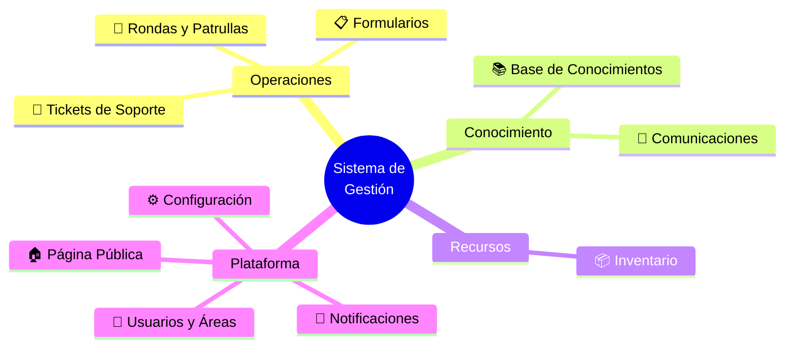
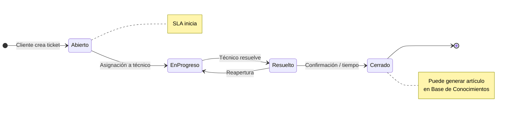
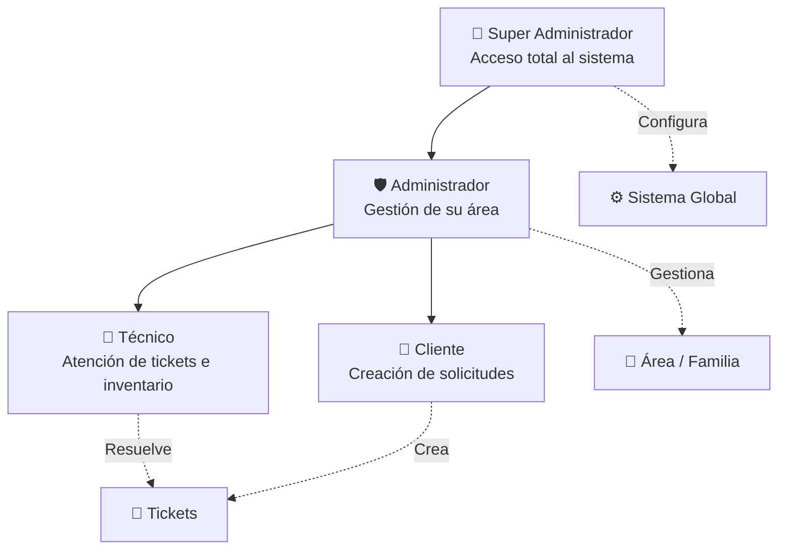
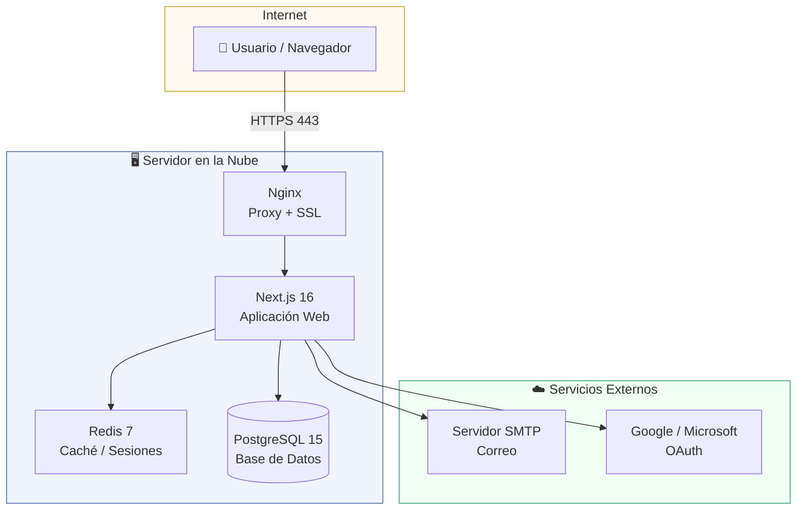
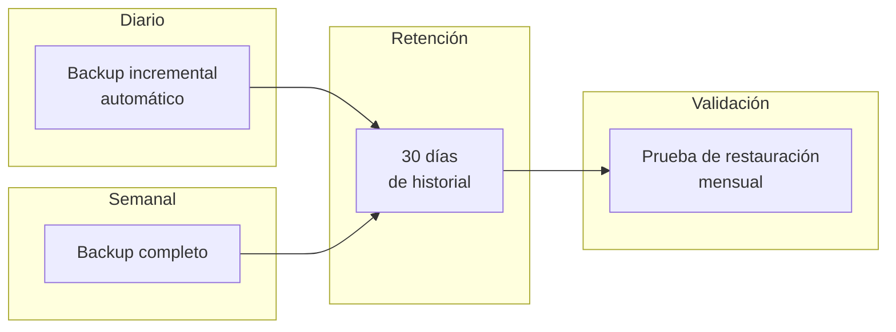
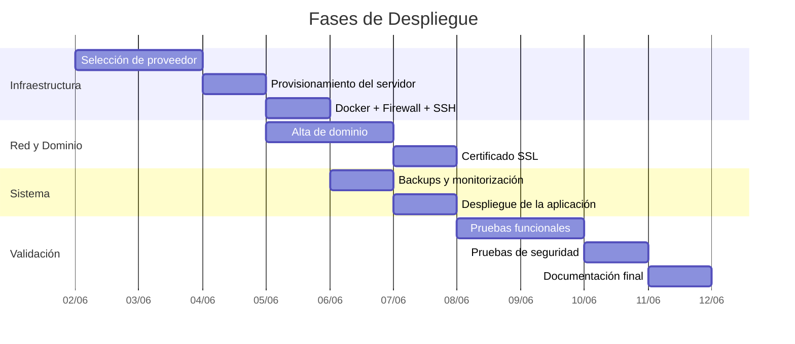

# Alcance del Proyecto — Sistema de Gestión Empresarial

**Documento técnico para selección y configuración de servidor**
**Versión:** 1.5 | **Fecha:** 2026-06-02

---

## Índice

1. [Descripción General](#1-descripción-general)
2. [Visión General del Sistema](#2-visión-general-del-sistema)
3. [Módulos de Operaciones](#3-módulos-de-operaciones)
   - 3.1 Tickets de Soporte
   - 3.2 Rondas y Patrullas
   - 3.3 Formularios Personalizados
4. [Módulos de Conocimiento](#4-módulos-de-conocimiento)
   - 4.1 Base de Conocimientos
   - 4.2 Comunicaciones Internas
5. [Módulos de Recursos](#5-módulos-de-recursos)
   - 5.1 Inventario _(En desarrollo)_
6. [Módulos de Plataforma](#6-módulos-de-plataforma)
   - 6.1 Usuarios y Áreas
   - 6.2 Notificaciones
   - 6.3 Página Pública (CMS)
   - 6.4 Configuración y Seguridad
7. [Stack Tecnológico y Arquitectura](#7-stack-tecnológico-y-arquitectura)
8. [Requisitos de Servidor](#8-requisitos-de-servidor)
9. [Seguridad](#9-seguridad)
10. [Disponibilidad, Backups y Recuperación](#10-disponibilidad-backups-y-recuperación)
11. [Plan de Despliegue](#11-plan-de-despliegue)
12. [Referencias](#12-referencias)

---

## 1. Descripción General

Sistema web integral para la gestión operativa de la empresa, desarrollado en Next.js con arquitectura containerizada (Docker). Cubre soporte técnico, base de conocimientos, inventario, comunicaciones internas y seguridad física, con control de acceso por roles y notificaciones en tiempo real.

El sistema está organizado en **4 grupos funcionales** y **10 módulos** que se detallan en este documento siguiendo esa misma estructura.

---

## 2. Visión General del Sistema

El siguiente diagrama muestra los 10 módulos del sistema organizados por grupo funcional. Esta estructura es la que guía el resto del documento.

> Los módulos de **Operaciones** son el núcleo del sistema. **Conocimiento** y **Recursos** complementan la operación diaria. **Plataforma** agrupa las capacidades transversales que dan soporte a todos los demás módulos.

---

## 3. Módulos de Operaciones

Este grupo concentra las funciones del día a día: atención de solicitudes, vigilancia y captura de información operativa.

### 3.1 🎫 Tickets de Soporte

Módulo central del sistema. Gestiona las solicitudes de soporte desde su creación hasta su cierre, con trazabilidad completa y cumplimiento de SLA.

**Ciclo de vida de un ticket:**

**Capacidades:**

- SLA automático por prioridad: Urgente, Alto, Medio, Bajo
- Asignación automática y manual a técnicos
- Categorías en 4 niveles jerárquicos
- Comentarios, archivos adjuntos y auditoría de actividad
- Reportes: tiempo de respuesta, cumplimiento SLA, carga por técnico
- Exportación a Excel, PDF y CSV

---

### 3.2 🚶 Rondas y Patrullas

Permite planificar y registrar recorridos de seguridad física, con evidencia geolocalizada en cada punto de control.

**Capacidades:**

- Planificación de rutas con puntos de control geolocalizados
- Registro de incidencias y evidencia fotográfica por punto
- Programación de horarios automática
- Reportes de cumplimiento de rondas

---

### 3.3 📋 Formularios Personalizados

Permite crear formularios operativos adaptados a cada área, sin necesidad de desarrollo adicional.

**Capacidades:**

- Campos configurables: texto, número, fecha, selección, archivos
- Asignación por área o familia
- Respuestas exportables e integración con tickets y otros módulos

---

## 4. Módulos de Conocimiento

Este grupo gestiona la información generada por la operación y su comunicación hacia los usuarios.

### 4.1 📚 Base de Conocimientos

Repositorio interno de soluciones y procedimientos. Se alimenta directamente de tickets resueltos, convirtiendo la experiencia operativa en conocimiento reutilizable.

**Capacidades:**

- Artículos generados desde tickets resueltos
- Búsqueda full-text avanzada
- Clasificación por utilidad y sistema de votación
- Acceso controlado por rol: público, técnicos, administradores

---

### 4.2 📰 Comunicaciones Internas

Canal centralizado para noticias y anuncios dirigidos al equipo o a áreas específicas.

**Capacidades:**

- Publicación con fechas de vigencia (inicio y fin)
- Notificaciones automáticas a usuarios al publicar
- Archivos adjuntos en noticias
- Estadísticas de visualización

---

## 5. Módulos de Recursos

### 5.1 📦 Inventario _(En desarrollo)_

Control centralizado de todos los activos tecnológicos y físicos de la empresa. Actualmente en fase de desarrollo; los demás módulos están en producción.

**Submódulos:**

| Submódulo       | Descripción                                                      |
| --------------- | ---------------------------------------------------------------- |
| Equipos         | Código único, QR, historial de asignaciones y mantenimientos     |
| Licencias       | Claves encriptadas, alertas automáticas de vencimiento           |
| Consumibles     | Control de stock con alertas de nivel bajo                       |
| Contratos       | Gestión documental con archivos adjuntos                         |
| Actas digitales | Entrega, devolución y baja con PDF automático y folio secuencial |
| Proveedores     | Gestión por tipo y área                                          |

- Catálogos personalizables (tipos de equipo, licencia, consumible, unidades de medida)
- Reportes de inventario con exportación

---

## 6. Módulos de Plataforma

Capacidades transversales que sustentan el funcionamiento de todos los módulos anteriores.

### 6.1 👥 Usuarios y Áreas

Define la estructura organizacional del sistema: quién puede hacer qué y en qué áreas.

**Jerarquía de roles:**

**Capacidades:**

- Áreas (familias) con departamentos, técnicos y gestores asignados
- Configuración independiente de tickets e inventario por área
- Gestores de inventario delegados por área

---

### 6.2 🔔 Notificaciones

Sistema unificado de alertas que opera en todos los módulos.

| Canal              | Descripción                                 |
| ------------------ | ------------------------------------------- |
| En la aplicación   | Notificaciones en tiempo real               |
| Correo electrónico | Envío con reintentos automáticos ante fallo |
| Navegador (push)   | Notificaciones fuera de la aplicación       |

**Alertas automáticas configuradas:**

- Stock de consumibles por debajo del mínimo
- Licencias próximas a vencer
- Contratos próximos a vencer
- Garantías de equipos por vencer

---

### 6.3 🏠 Página Pública (CMS)

Sitio web corporativo editable desde el panel de administración, sin necesidad de modificar código.

**Capacidades:**

- Secciones configurables: Hero, Servicios, Banners
- SEO optimizado
- Control total desde el panel de administración

---

### 6.4 ⚙️ Configuración y Seguridad

Ajustes globales del sistema y controles de acceso.

**Configuración global:**

- SMTP para envío de correos
- Parámetros de SLA por prioridad
- Límites de tamaño de archivos adjuntos
- Login con Google y Microsoft (OAuth)

**Controles de seguridad:**

- Control de acceso por roles y áreas
- Auditoría completa de todas las acciones del sistema
- Bloqueo de cuenta por intentos de acceso fallidos
- Encriptación de datos sensibles (claves de licencias, etc.)
- Rate limiting contra ataques automatizados

---

## 7. Stack Tecnológico y Arquitectura

### Stack

| Componente     | Tecnología                |
| -------------- | ------------------------- |
| Aplicación Web | Next.js 16 (App Router)   |
| Lenguaje       | TypeScript                |
| Base de Datos  | PostgreSQL 15             |
| Caché          | Redis 7                   |
| Contenedores   | Docker + Docker Compose   |
| Autenticación  | NextAuth.js (JWT + OAuth) |
| Proxy / SSL    | Nginx                     |

### Arquitectura en producción

Todos los componentes del servidor corren dentro de contenedores Docker gestionados con Docker Compose, lo que simplifica el despliegue, las actualizaciones y la portabilidad entre entornos.

---

## 8. Requisitos de Servidor

### Especificaciones según escala

| Tamaño              | vCPU | RAM   | Almacenamiento |
| ------------------- | ---- | ----- | -------------- |
| Hasta 20 usuarios   | 2    | 4 GB  | 50 GB SSD      |
| 20 – 100 usuarios   | 4    | 8 GB  | 100 GB SSD     |
| Más de 100 usuarios | 8    | 16 GB | 200 GB SSD     |

### Sistema Operativo y Conectividad

- **Recomendado:** Ubuntu 22.04 LTS
- **Servidor de pruebas actual:** Debian 13 (acceso SSH, sin interfaz gráfica)
- Requisito obligatorio: compatibilidad con Docker y Docker Compose
- Conectividad: mínimo 100 Mbps simétrico, IP pública fija
- Certificado SSL (Let's Encrypt o equivalente), firewall configurable

---

## 9. Seguridad

### Servidor

- Firewall con puertos mínimos expuestos: 80 (HTTP), 443 (HTTPS), 22 (SSH)
- Acceso exclusivamente por clave SSH, sin contraseñas
- HTTPS obligatorio en todos los entornos

### Aplicación

- Secretos y credenciales gestionados por variables de entorno, nunca en el código
- Rotación periódica de claves y credenciales de acceso
- Auditoría de todas las acciones de usuarios habilitada
- Rate limiting y bloqueo por intentos fallidos activados

---

## 10. Disponibilidad, Backups y Recuperación

### Objetivos de nivel de servicio

| Métrica                        | Objetivo  |
| ------------------------------ | --------- |
| Disponibilidad mensual         | ≥ 99.9%   |
| Tiempo de respuesta del API    | < 500 ms  |
| Tiempo de carga de página      | < 2 s     |
| Tiempo de restauración (RTO)   | < 4 horas |
| Ventana de ejecución de backup | < 1 hora  |

### Política de backups

- **Backup incremental:** diario, automatizado, sin intervención manual
- **Backup completo:** semanal, incluye base de datos y archivos adjuntos
- **Retención:** 30 días de historial disponible para restauración
- **Validación:** prueba de restauración real ejecutada cada mes para garantizar integridad
- **Almacenamiento:** los backups se guardan en ubicación separada al servidor principal

---

## 11. Plan de Despliegue

**Checklist de despliegue:**

- [ ] Selección de proveedor y plan de hosting
- [ ] Provisionamiento del servidor y configuración de SO
- [ ] Instalación de Docker y Docker Compose
- [ ] Configuración de firewall y acceso SSH
- [ ] Alta y configuración del dominio
- [ ] Emisión e instalación de certificado SSL
- [ ] Configuración de backups automáticos
- [ ] Configuración de monitorización
- [ ] Despliegue del sistema
- [ ] Validación funcional y pruebas de humo
- [ ] Pruebas de seguridad
- [ ] Documentación de configuración final

---

## 12. Referencias

- [`README.md`](./README.md) — Descripción general del sistema
- [`DEPLOYMENT.md`](./DEPLOYMENT.md) — Guía de despliegue
- [`SETUP.md`](./SETUP.md) — Configuración inicial
