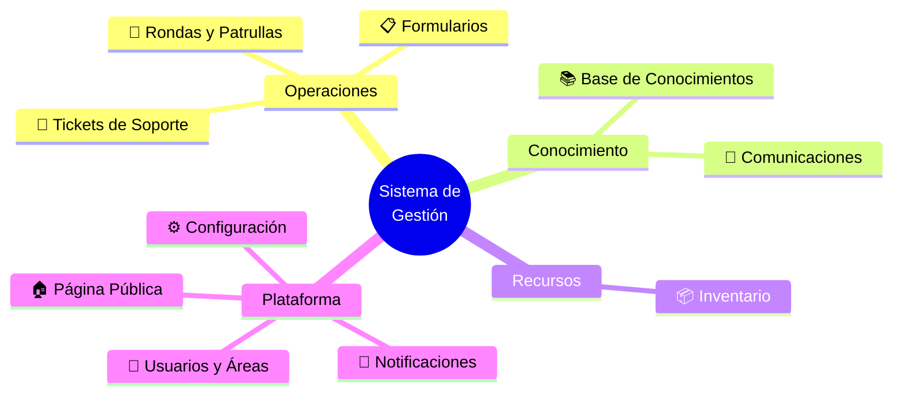
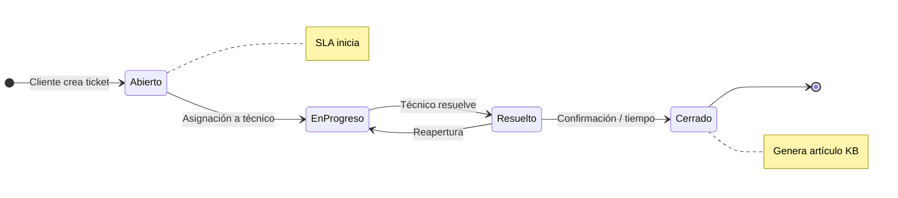
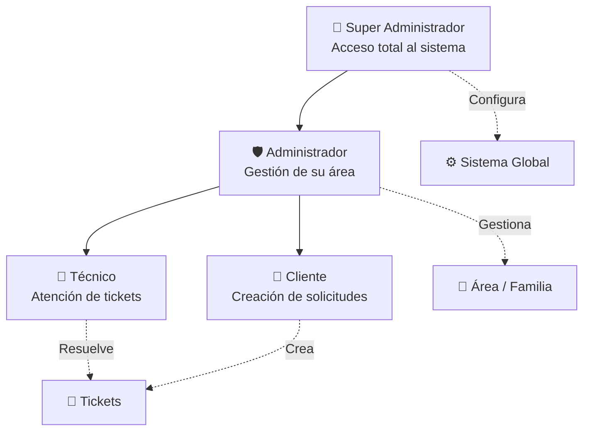
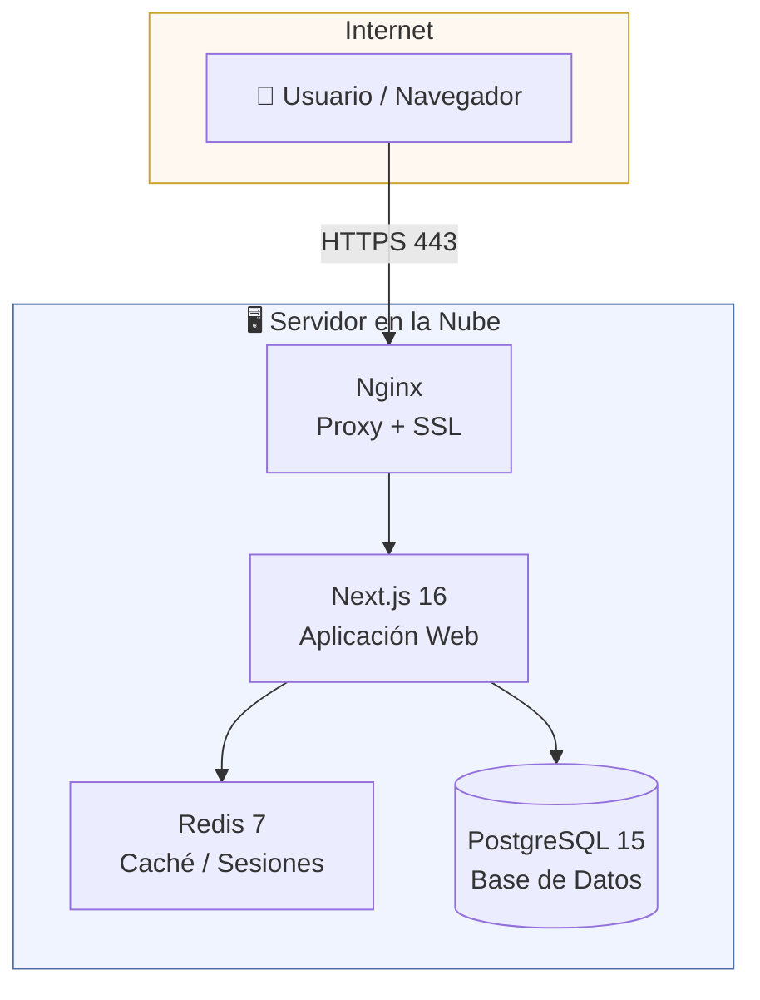
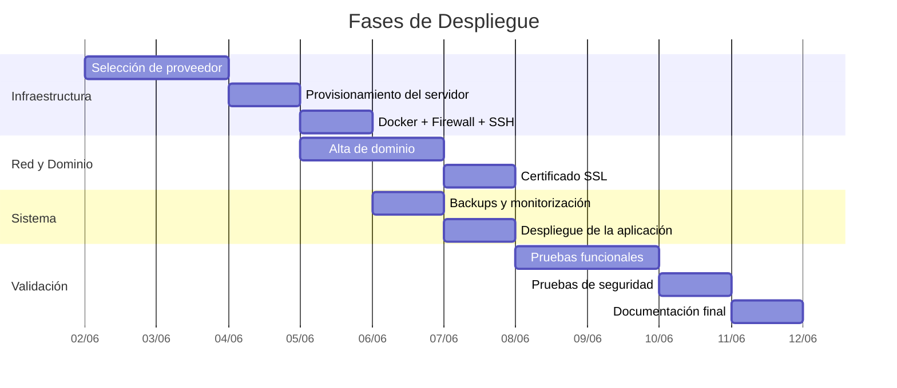

# Alcance del Proyecto — Sistema de Gestión Empresarial

**Documento técnico para selección y configuración de servidor**
**Versión:** 1.4 | **Fecha:** 2026-06-01

---

## 1. Descripción General

Sistema web integral para la gestión operativa de la empresa, desarrollado en Next.js con arquitectura containerizada (Docker). Cubre soporte técnico, base de conocimientos, inventario, comunicaciones internas y seguridad física, con control de acceso por roles y notificaciones en tiempo real.

---

## 2. Módulos Funcionales

El sistema está compuesto por **10 módulos** que cubren las operaciones principales de la empresa. El inventario se encuentra actualmente en desarrollo.

---

### 🎫 Tickets de Soporte

**Ciclo de vida de un ticket:**

- Ciclo de vida completo: Abierto → En Progreso → Resuelto → Cerrado
- SLA automático por prioridad (Urgente, Alto, Medio, Bajo)
- Asignación automática y manual a técnicos
- Categorías en 4 niveles jerárquicos
- Comentarios, archivos adjuntos y auditoría de actividad
- Reportes de tiempo de respuesta, cumplimiento SLA y carga por técnico
- Exportación a Excel, PDF y CSV

### 📚 Base de Conocimientos

- Artículos generados desde tickets resueltos
- Búsqueda full-text avanzada
- Clasificación por utilidad y votación
- Acceso por roles (público, técnicos, administradores)

### 📦 Inventario _(En desarrollo)_

- **Equipos:** código único, QR, historial de asignaciones y mantenimientos
- **Licencias:** claves encriptadas, alertas de vencimiento automáticas
- **Consumibles:** control de stock con alertas de nivel bajo
- **Contratos:** gestión documental con archivos adjuntos
- **Actas digitales:** entrega, devolución y baja con PDF automático y folio secuencial
- **Proveedores:** gestión por tipo y área
- Catálogos personalizables y reportes con exportación

### 🚶 Rondas y Patrullas

- Planificación de rutas con puntos de control geolocalizados
- Registro de incidencias y evidencia fotográfica
- Programación de horarios y reportes de cumplimiento

### 📰 Comunicaciones Internas

- Publicación de noticias y anuncios con fechas de vigencia
- Notificaciones automáticas a usuarios
- Estadísticas de visualización

### 📋 Formularios Personalizados

- Campos configurables: texto, número, fecha, selección, archivos
- Asignación por área o familia
- Respuestas exportables e integración con otros módulos

### 👥 Usuarios y Áreas

**Jerarquía de roles y permisos:**

- Roles: Super Administrador, Administrador, Técnico, Cliente
- Áreas (familias) con departamentos, técnicos y gestores asignados
- Configuración independiente de tickets e inventario por área

### 🔔 Notificaciones

- Notificaciones en tiempo real dentro de la aplicación
- Correos electrónicos con reintentos automáticos
- Notificaciones del navegador (push)
- Alertas automáticas: stock bajo, licencias y contratos por vencer

### 🏠 Página Pública (CMS)

- Secciones editables desde el panel: Hero, Servicios, Banners
- SEO optimizado, sin necesidad de modificar código

### ⚙️ Configuración y Seguridad

- Configuración global: SMTP, SLA, límites de archivos
- Autenticación con Google y Microsoft (OAuth)
- Control de acceso por roles y áreas
- Auditoría completa de acciones
- Bloqueo de cuenta por intentos fallidos
- Encriptación de datos sensibles y rate limiting

---

## 3. Stack Tecnológico

| Componente     | Tecnología                |
| -------------- | ------------------------- |
| Aplicación Web | Next.js 16 (App Router)   |
| Lenguaje       | TypeScript                |
| Base de Datos  | PostgreSQL 15             |
| Caché          | Redis 7                   |
| Contenedores   | Docker + Docker Compose   |
| Autenticación  | NextAuth.js (JWT + OAuth) |
| Proxy / SSL    | Nginx                     |

**Arquitectura en producción:**

---

## 4. Requisitos de Servidor

### 4.1 Especificaciones según escala

| Tamaño              | vCPU | RAM   | Almacenamiento |
| ------------------- | ---- | ----- | -------------- |
| Hasta 20 usuarios   | 2    | 4 GB  | 50 GB SSD      |
| 20 – 100 usuarios   | 4    | 8 GB  | 100 GB SSD     |
| Más de 100 usuarios | 8    | 16 GB | 200 GB SSD     |

### 4.2 Sistema Operativo y Red

- **Recomendado:** Ubuntu 22.04 LTS
- **Servidor de pruebas actual:** Debian 13 (acceso SSH, sin interfaz gráfica)
- Requisito: compatibilidad con Docker y Docker Compose
- Conectividad: mínimo 100 Mbps simétrico, IP pública fija
- Certificado SSL (Let's Encrypt o equivalente), firewall configurable

---

## 5. Seguridad

- Firewall con puertos mínimos expuestos: 80 (HTTP), 443 (HTTPS), 22 (SSH)
- Acceso al servidor exclusivamente por clave SSH
- HTTPS obligatorio en todos los entornos
- Secretos y credenciales gestionados por variables de entorno, nunca en el código
- Rotación periódica de claves y credenciales
- Auditoría de acciones de usuarios habilitada

---

## 6. Disponibilidad y Backups

| Métrica                      | Objetivo  |
| ---------------------------- | --------- |
| Disponibilidad mensual       | ≥ 99.9%   |
| Tiempo de respuesta          | < 500 ms  |
| Tiempo de carga de página    | < 2 s     |
| Tiempo de restauración (RTO) | < 4 horas |
| Ventana de backup            | < 1 hora  |

**Política de backups:**

- Backup incremental diario automatizado
- Backup completo semanal
- Retención: 30 días
- Verificación de restauración mensual

---

## 7. Plan de Despliegue

- [ ] Selección de proveedor y plan de hosting
- [ ] Provisionamiento del servidor y configuración de SO
- [ ] Instalación de Docker y Docker Compose
- [ ] Configuración de firewall y acceso SSH
- [ ] Alta y configuración del dominio
- [ ] Emisión e instalación de certificado SSL
- [ ] Configuración de backups automáticos
- [ ] Configuración de monitorización
- [ ] Despliegue del sistema
- [ ] Validación funcional y pruebas de humo
- [ ] Pruebas de seguridad
- [ ] Documentación de configuración final

---

## 8. Referencias

- [`README.md`](./README.md) — Descripción general del sistema
- [`DEPLOYMENT.md`](./DEPLOYMENT.md) — Guía de despliegue
- [`SETUP.md`](./SETUP.md) — Configuración inicial
