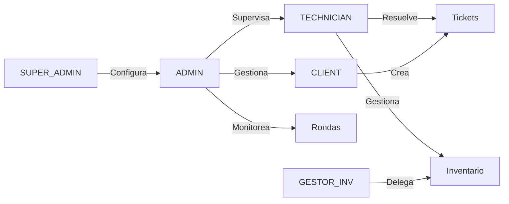
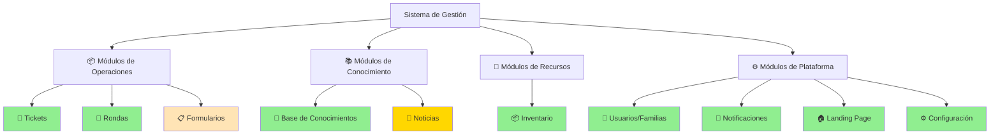

# DOCUMENTO DE ESPECIFICACIÓN TÉCNICA Y ALCANCE DEL PROYECTO

## Sistema Integral de Gestión Empresarial — Tickets, Inventario e Inteligencia Operativa

**Documento de Especificación de Requerimientos y Alcance de Software**

---

## CONTROL DE DOCUMENTO

| Aspecto                  | Valor                                   |
| ------------------------ | --------------------------------------- |
| **Versión**              | 1.0                                     |
| **Fecha de Elaboración** | Junio 2026                              |
| **Última Actualización** | Junio 24, 2026                          |
| **Estado**               | En Producción Parcial                   |
| **Clasificación**        | Documento Técnico Profesional           |
| **Audiencia**            | Stakeholders, Equipo Técnico, Auditoría |

---

## TABLA DE CONTENIDOS

1. [RESUMEN EJECUTIVO](#1-resumen-ejecutivo)
2. [ANÁLISIS DEL PROYECTO](#2-análisis-del-proyecto)
3. [OBJETIVOS DEL SISTEMA](#3-objetivos-del-sistema)
4. [ALCANCE DEL SISTEMA](#4-alcance-del-sistema)
5. [LIMITACIONES DEL SISTEMA](#5-limitaciones-del-sistema)
6. [REQUISITOS DEL SISTEMA](#6-requisitos-del-sistema)
7. [RIESGOS IDENTIFICADOS](#7-riesgos-identificados)
8. [CONCLUSIONES Y RECOMENDACIONES](#8-conclusiones-y-recomendaciones)

---

## 1. RESUMEN EJECUTIVO

### 1.1 Descripción General del Proyecto

El proyecto **"Sistema Integral de Gestión Empresarial"** es una plataforma web de clase empresarial desarrollada en **Next.js 16.1.1** con arquitectura modular y escalable. El sistema proporciona soluciones integradas para la gestión operativa de organizaciones medianas a grandes, consolidando en una única plataforma funciones de soporte técnico, gestión de inventario, base de conocimientos corporativa, comunicaciones internas y control de seguridad física.

**Identificador del Proyecto:** Sistema de Gestión — Tickets e Inventario  
**Período de Desarrollo:** Iniciado en 2026 (datos desde marzo a junio)  
**Versión Actual:** 0.1.0 (Alpha / Beta extendida)  
**Modelo de Despliegue:** Containerizado (Docker + Docker Compose)

### 1.2 Objetivo Principal

Desarrollar e implementar una plataforma unificada de gestión operativa que centralice la canalización de solicitudes de soporte técnico, la administración de inventario de activos empresariales, la gestión del conocimiento organizacional y el monitoreo de seguridad física, eliminando silos de información y mejorando la trazabilidad, eficiencia y cumplimiento de acuerdos de nivel de servicio (SLA).

### 1.3 Justificación del Sistema

**Necesidades Organizacionales Identificadas:**

| Necesidad                          | Justificación                                                                                               |
| ---------------------------------- | ----------------------------------------------------------------------------------------------------------- |
| **Fragmentación de Procesos**      | Múltiples herramientas desconectadas generan redundancia, inconsistencia de datos y pérdida de trazabilidad |
| **Ausencia de Trazabilidad**       | No existe registro centralizado de solicitudes, decisiones y cambios en activos organizacionales            |
| **Ineficiencia en SLA**            | Falta de automatización y monitoreo de tiempos de respuesta impacta satisfacción del cliente                |
| **Gestión Deficiente de Activos**  | Desconocimiento del estado, ubicación y disponibilidad de equipos y licencias genera costos innecesarios    |
| **Brecha de Conocimiento**         | El expertise de técnicos está disperso sin mecanismo de captura y reutilización                             |
| **Seguridad Física Débil**         | Ausencia de registro digital de rondas de seguridad reduce capacidad de auditoría y respuesta a incidentes  |
| **Falta de Visibilidad Ejecutiva** | Ausencia de reportes consolidados dificulta toma de decisiones estratégicas                                 |

### 1.4 Contexto y Viabilidad

El proyecto aprovecha tecnologías modernas, cloud-ready y de código abierto, permitiendo escalabilidad horizontal, independencia de proveedores y reducción de costos de licenciamiento. Su arquitectura modular posibilita implementación gradual de funcionalidades, reducing risk de adopción.

---

## 2. ANÁLISIS DEL PROYECTO

### 2.1 Problema o Necesidad que Resuelve

El sistema aborda cinco problemas críticos detectados en operaciones empresariales típicas:

#### **Problema 1: Gestión Desorganizada de Solicitudes de Soporte**

**Síntomas:**

- Solicitudes gestionadas por email, chat o papel
- Pérdida de contexto y duplicación de esfuerzos
- Imposibilidad de medir tiempos de respuesta
- Falta de asignación sistemática a técnicos

**Solución Proporcionada:**

- Módulo centralizado de tickets con ciclo de vida definido (OPEN → IN_PROGRESS → RESOLVED → CLOSED)
- SLA automático con 4 niveles de prioridad
- Asignación inteligente basada en carga de trabajo y especialización
- Reportes de cumplimiento y métricas de desempeño

#### **Problema 2: Invisibilidad del Inventario de Activos**

**Síntomas:**

- Desconocimiento de equipos disponibles, ubicación y estado
- Pérdida de equipos por falta de control
- Imposibilidad de validar cumplimiento de auditoría
- Duplicación innecesaria de compras

**Solución Proporcionada:**

- Registro centralizado con código único y QR por activo
- Seguimiento de ciclo de vida (disponible, asignado, mantenimiento, retirado)
- Actas digitales con folio secuencial y PDF
- Integración con tickets para vinculación con incidentes

#### **Problema 3: Fragmentación del Conocimiento Técnico**

**Síntomas:**

- Soluciones reinventadas múltiples veces
- Onboarding lento de nuevos técnicos
- Dependencia de individuos clave
- Incapacidad de escalar equipo

**Solución Proporcionada:**

- Base de conocimientos autoalimentada desde tickets resueltos
- Búsqueda full-text avanzada
- Sistema de votación de utilidad
- Acceso granular por rol

#### **Problema 4: Ausencia de Control de Seguridad Física**

**Síntomas:**

- Rondas de vigilancia sin registro digital
- Imposibilidad de auditar cumplimiento
- Falta de evidencia fotográfica de incidencias
- Sin alertas en tiempo real de anomalías

**Solución Proporcionada:**

- Módulo de rondas con puntos de control geolocalizados
- Soporte offline con sincronización posterior
- Validación por QR con ventana de tiempo
- Captura de incidencias con evidencia fotográfica

#### **Problema 5: Aislamiento Informativo**

**Síntomas:**

- Comunicaciones internas fragmentadas
- Falta de canales unificados de información
- Baja visibilidad de cambios y decisiones
- Dificultad en coordinación interdepartamental

**Solución Proporcionada:**

- Sistema integrado de notificaciones (in-app, email, navegador)
- Módulo de comunicados y noticias
- Alertas automáticas de eventos críticos
- Histórico auditable de cambios

### 2.2 Contexto Organizacional

**Scope de Operaciones:**

- Organización mediana a grande (100+ empleados)
- Estructura descentralizada por áreas o departamentos (familias)
- Múltiples roles con responsabilidades y permisos diferenciados
- Necesidad de cumplimiento normativo y auditoría

**Modelo Operativo:**

- Estructura organizacional basada en "Familias" (áreas funcionales: TI, Mantenimiento, Recursos Humanos, etc.)
- Departamentos dentro de cada familia
- Técnicos asignados por especialización
- Gestores de inventario delegados en familias específicas
- Clientes internos y externos

**Contexto Técnico:**

- Infraestructura containerizada moderna
- Capacidad de despliegue en múltiples ambientes (desarrollo, staging, producción)
- Conectividad nacional e internacional
- Requisitos de disponibilidad 24/7 para algunos módulos

### 2.3 Procesos Involucrados

#### **Proceso 1: Gestión de Tickets de Soporte**

- Creación → Asignación → Resolución → Cierre
- Integración con categorías jerárquicas y SLA
- Generación de artículos de conocimiento

#### **Proceso 2: Gestión de Inventario**

- Registro de activos → Asignación → Mantenimiento → Baja
- Actas digitales (entrega, devolución, baja)
- Alertas de stock y vencimientos

#### **Proceso 3: Gestión de Rondas de Seguridad**

- Planificación de rutas → Ejecución con check-in → Reportes
- Validación con QR dinámico
- Captura de incidencias con geolocalización

#### **Proceso 4: Gestión de Conocimiento**

- Captura de soluciones desde tickets
- Organización en repositorio
- Búsqueda y consulta por usuarios

#### **Proceso 5: Gestión de Configuración**

- Definición de roles y permisos
- Configuración de familias y departamentos
- Customización de categorías y catálogos

#### **Proceso 6: Gestión de Usuarios**

- Creación y onboarding
- Asignación de roles y permisos
- Configuración de preferencias

### 2.4 Actores o Usuarios del Sistema

| Rol                             | Descripción                   | Responsabilidades                                        | Volumen Estimado |
| ------------------------------- | ----------------------------- | -------------------------------------------------------- | ---------------- |
| **SUPER_ADMIN**                 | Administrador del sistema     | Configuración global, auditoría, seguridad               | 1-3 personas     |
| **ADMIN**                       | Administrador de familia      | Gestión de área asignada, usuarios, tickets e inventario | 3-10 personas    |
| **TECHNICIAN**                  | Técnico de soporte            | Resolución de tickets, gestión de activos asignados      | 10-50 personas   |
| **CLIENT**                      | Usuario final/cliente interno | Crear solicitudes, ver estado, calificar resolución      | 50-500 personas  |
| **GERENTE DE SEGURIDAD FÍSICA** | Supervisor de rondas          | Planificación, supervisión y reportes de rondas          | 1-5 personas     |
| **GESTOR DE INVENTARIO**        | Delegado de inventario (flag) | Gestión de inventario específico de familia              | 3-15 personas    |

**Matriz de Participación:**



---

## 3. OBJETIVOS DEL SISTEMA

### 3.1 Objetivo General

Desarrollar, implementar y mantener una plataforma integrada de gestión operativa que centralice la canalización de solicitudes de soporte, administración de inventario y monitoreo de seguridad, proporcionando a la organización:

- Visibilidad total de operaciones
- Automatización de procesos rutinarios
- Trazabilidad completa para auditoría
- Escalabilidad para crecimiento futuro
- Resiliencia ante fallos operacionales

### 3.2 Objetivos Específicos

| #       | Objetivo                                               | Métrica de Éxito                              | Plazo   |
| ------- | ------------------------------------------------------ | --------------------------------------------- | ------- |
| **O1**  | Implementar módulo de tickets con SLA automático       | 95% de tickets dentro de SLA                  | Q3 2026 |
| **O2**  | Centralizar inventario de activos con visibilidad 100% | 100% de activos registrados y rastreables     | Q4 2026 |
| **O3**  | Crear base de conocimientos autoalimentada             | 500+ artículos en Y1, 80%+ utilidad media     | Q4 2026 |
| **O4**  | Implementar rondas de seguridad con auditoría          | 100% de rondas programadas completadas        | Q3 2026 |
| **O5**  | Establecer control de acceso granular por rol          | 0 accesos no autorizados detectados           | Q2 2026 |
| **O6**  | Lograr disponibilidad 99.5% en producción              | Uptime ≥ 99.5% medido mensualmente            | Q3 2026 |
| **O7**  | Reducir tiempo de respuesta promedio a tickets         | Reducción del 50% vs. baseline                | Q3 2026 |
| **O8**  | Eliminar pérdida de equipos por falta de control       | Varianza de inventario ≤ 2% anualmente        | Q4 2026 |
| **O9**  | Implementar auditoría completa de acciones             | 100% de acciones registradas con trazabilidad | Q3 2026 |
| **O10** | Lograr adopción de usuarios ≥ 80% en Y1                | 80%+ de usuarios activos mensualmente         | Q4 2026 |

---

## 4. ALCANCE DEL SISTEMA

### 4.1 Funcionalidades Incluidas

#### **Módulo 1: Gestión de Tickets de Soporte** ✅

**Funcionalidades Core:**

- Creación de tickets por clientes internos/externos
- Estados: OPEN, IN_PROGRESS, RESOLVED, CLOSED, CANCELLED
- Asignación automática y manual a técnicos
- SLA con 4 niveles de prioridad (URGENT, HIGH, MEDIUM, LOW)
- Comentarios públicos e internos
- Adjuntos (imágenes, PDF, Office)
- Timeline de actividad auditable
- Colaboradores múltiples en tickets
- Calificación de resolución por cliente

**Capacidades Avanzadas:**

- Categorías jerárquicas (hasta 4 niveles)
- Sugerencias inteligentes de categoría
- Planes de resolución con tareas
- Vinculación automática a artículos de conocimiento
- Reportes de SLA, tiempos, carga de trabajo
- Exportación CSV/Excel/PDF
- Predicción de SLA violations

**Integraciones:**

- Autofeed a Base de Conocimientos
- Integración con rondas (incidencias PATROL)
- Vinculación con inventario (equipos relacionados)

#### **Módulo 2: Gestión de Inventario** ✅

**Funcionalidades Core:**

- **Equipos:** registro con código único, QR, historial de asignaciones
- **Licencias:** gestión de claves (encriptadas), control de vencimiento
- **Consumibles (MRO):** control de stock con movimientos
- **Contratos:** gestión de servicios con líneas y adjuntos
- **Actas Digitales:** entrega, devolución, baja con folio secuencial

**Capacidades Avanzadas:**

- Modalidades: activo fijo, arrendamiento, préstamo de tercero
- Estados: AVAILABLE, ASSIGNED, MAINTENANCE, DAMAGED, RETIRED
- Condiciones: NEW, LIKE_NEW, GOOD, FAIR, POOR
- Depreciación configurable por familia
- Bodegas y ubicaciones
- Proveedores con gestión inline
- Alertas de stock bajo
- Alertas de vencimiento (licencias, contratos, garantías)
- Reportes de inventario por familia, usuario, estado

**Catálogos Dinámicos:**

- Tipos de equipo, licencia, consumible, proveedor
- Unidades de medida personalizables
- Todas editables desde UI sin desarrollo

#### **Módulo 3: Gestión de Rondas y Patrullas** ✅

**Funcionalidades Core:**

- Planificación de rutas con puntos de control geolocalizados
- Soporte offline con sincronización posterior
- Validación de check-in por QR (dinámico o estático)
- Ventana de tiempo configurable para validación
- Registro de incidencias con evidencia fotográfica
- Programación recurrente (diario, semanal, personalizado)

**Capacidades Avanzadas:**

- Reportes de cumplimiento con porcentaje de completitud
- Historial de rondas con métricas
- Integración con tickets (creación automática de PATROL incidents)
- Asignación de agentes de seguridad
- Notificaciones en tiempo real de desviaciones

#### **Módulo 4: Base de Conocimientos** ✅

**Funcionalidades Core:**

- Artículos generados desde tickets resueltos (1-click)
- Búsqueda full-text avanzada
- Votación de utilidad
- Acceso por rol (público, técnicos, admins)
- Categorías jerárquicas

**Capacidades Avanzadas:**

- Vinculación automática a tickets relacionados
- Histórico de versiones
- Comentarios en artículos
- Tags y metadatos
- Análisis de utilidad

#### **Módulo 5: Gestión de Usuarios y Familias** ✅

**Funcionalidades Core:**

- Cuatro roles: SUPER_ADMIN, ADMIN, TECHNICIAN, CLIENT
- Creación, edición, bloqueo de cuentas
- Avatar de usuario (upload de foto)
- Bloqueo por intentos fallidos
- Recuperación de contraseña
- OAuth (Google, Microsoft)

**Capacidades Avanzadas:**

- Gestión de familias (áreas) con departamentos
- Asignación de técnicos a familias
- Asignación de gestores de inventario (`canManageInventory`)
- Configuración por familia (tickets, inventario)
- Exportación de usuarios con filtros
- Histórico de acceso y actividad

#### **Módulo 6: Notificaciones** ✅

**Funcionalidades Core:**

- Notificaciones in-app en tiempo real (SSE)
- Email con cola y reintentos
- Notificaciones nativas del navegador
- Sonido configurable

**Tipos de Alertas:**

- Stock bajo en consumibles
- Licencias por vencer (1ra y 2da alerta)
- Contratos por vencer
- Garantías por vencer
- Actas de entrega pendientes de aceptación
- Cambios de estado en tickets
- Asignaciones de tickets

#### **Módulo 7: Landing Page (CMS)** ✅

**Funcionalidades:**

- Página pública configurable sin código
- Secciones: Hero, servicios, banners
- Logo claro/oscuro configurable
- Metadatos SEO
- Editor visual

#### **Módulo 8: Configuración del Sistema** ✅

**Configuración Global:**

- SMTP (con prueba desde UI)
- Timeouts de sesión
- Límites de archivos
- Intentos máximos de login
- Auto-cierre de tickets resueltos
- Backups automáticos

**Configuración por Familia:**

- Categorías habilitadas/deshabilitadas
- Reglas de tickets
- Subtipos de inventario
- Depreciación por defecto
- Prefijo de código de activo

#### **Módulo 9: Auditoría y Reportes** ✅

**Funcionalidades Core:**

- Registro de todas las acciones (creación, edición, eliminación, login)
- Filtros por entidad, acción, usuario, período
- Estadísticas de actividad
- Acceso solo SUPER_ADMIN

**Reportes Disponibles:**

- Tickets: SLA, tiempos, carga por técnico
- Inventario: estado, por usuario, stock bajo
- Usuarios: acceso, actividad
- Sistema: auditoría, caché, rendimiento

#### **Módulo 10: Comunicados y Noticias** ⚠️ (En curso)

**Funcionalidades Core:**

- Creación de noticias/comunicados
- Distribución por rol, usuario, departamento
- Feed personalizado
- Reacciones y comentarios
- Contador de vistas

**Estado:** Modelo de datos completo, API funcional, integración en dashboards. Pendiente: filtros avanzados y exportación.

### 4.2 Módulos Contemplados



**Leyenda:**

- ✅ Verde: Funcionalidad implementada y en producción
- ⚠️ Naranja: En desarrollo o parcialmente implementado
- ⏳ Gris: Planeado para futuras versiones

### 4.3 Procesos que serán Automatizados

| Proceso                      | Descripción                                                | Beneficio                                       |
| ---------------------------- | ---------------------------------------------------------- | ----------------------------------------------- |
| **SLA Automático**           | Cálculo y monitoreo de tiempos de respuesta/resolución     | Elimina errores manuales, alertas proactivas    |
| **Asignación de Tickets**    | Distribución inteligente basada en carga y especialización | Balanceo de carga, reducción de tiempo muerto   |
| **Generación de Artículos**  | Crear conocimiento desde tickets resueltos                 | Captura automática de expertise                 |
| **Alertas de Inventario**    | Notificaciones de stock bajo, vencimientos                 | Evita rupturas de stock, cumplimiento normativo |
| **Actas Digitales**          | Generación de PDF con folio secuencial                     | Trazabilidad legal, reducción de papelería      |
| **Sincronización de Rondas** | Sincronización offline de móviles a servidor               | Operación sin conectividad continua             |
| **Caché de Sesión**          | Refresco de permisos en Redis                              | Autorización distribuida escalable              |
| **Backups**                  | Respaldo automático de BD por módulo                       | Recuperación ante desastres                     |
| **Emails**                   | Cola asíncrona con reintentos                              | Entregas confiables sin bloquear API            |

### 4.4 Integraciones Previstas

**Integraciones Implementadas:**

| Integración                  | Descripción                           | Estado          |
| ---------------------------- | ------------------------------------- | --------------- |
| **NextAuth + OAuth**         | Autenticación Google, Microsoft       | ✅ Implementada |
| **Prisma ORM**               | Gestión de BD con migraciones         | ✅ Implementada |
| **Redis**                    | Caché distribuido y rate limiting     | ✅ Implementada |
| **Server-Sent Events (SSE)** | Notificaciones en tiempo real         | ✅ Implementada |
| **Nodemailer**               | Envío de emails                       | ✅ Implementada |
| **PDF Kit**                  | Generación de actas y reportes PDF    | ✅ Implementada |
| **QRCode**                   | Generación de códigos QR para activos | ✅ Implementada |
| **Recharts**                 | Visualización de reportes             | ✅ Implementada |

**Integraciones Futuras Posibles:**

| Integración                | Descripción                                      | Impacto |
| -------------------------- | ------------------------------------------------ | ------- |
| **ERP (SAP, Oracle)**      | Sincronización de maestros de activos            | Alto    |
| **LDAP/Active Directory**  | Sincronización de usuarios corporativos          | Medio   |
| **Jira/ServiceNow**        | Integración con herramientas externas de tickets | Medio   |
| **Slack/Teams**            | Notificaciones en canales de mensajería          | Bajo    |
| **Google Drive/OneDrive**  | Almacenamiento en la nube de adjuntos            | Medio   |
| **API de Geolocalización** | Mapas avanzados para rondas                      | Bajo    |

### 4.5 Entregables Esperados

**En Implementación Actual:**

| Entregable                  | Descripción                                  | Plazo   |
| --------------------------- | -------------------------------------------- | ------- |
| **Sistema Funcional**       | Plataforma operativa en Docker               | Q3 2026 |
| **Documentación Técnica**   | Manuales, guías de operación, arquitectura   | Q3 2026 |
| **Guías de Usuario**        | Manual por rol (Admin, Técnico, Cliente)     | Q3 2026 |
| **Scripts de Migración**    | Herramientas para migrar datos legacy        | Q4 2026 |
| **Capacitación**            | Sesiones de onboarding por rol               | Q4 2026 |
| **Respaldo y Recuperación** | Procedimientos de backup y disaster recovery | Q3 2026 |

**Futuros Entregables:**

- Mobile app (iOS/Android)
- Integración con sistemas ERP
- Reportes analíticos avanzados
- Machine learning para predicción de SLA
- API pública para terceros

### 4.6 Límites del Proyecto

#### **Funcionalidades Explícitamente EXCLUIDAS:**

| Funcionalidad                          | Razón de Exclusión                                     |
| -------------------------------------- | ------------------------------------------------------ |
| **Nómina y Recursos Humanos**          | Requiere compliance normativo complejo, fuera de scope |
| **Contabilidad Financiera**            | Requiere certificación contable, mejor tercerizado     |
| **CRM (Gestión de Clientes Externos)** | Mercado saturado, enfoque es interno                   |
| **Mobile App (v1)**                    | Prioridad es web, mobile en v2                         |
| **BI/Analytics Avanzado**              | Roadmap futuro, MVP es reportes estándar               |
| **Gestión de Proyectos (PM)**          | Herramientas especializadas son mejores                |
| **Videoconferencia**                   | Usar Zoom, Teams, Google Meet integrados               |
| **Facturación y Pagos**                | Dominio especializado, usar Stripe, PayPal             |

#### **Restricciones de Alcance:**

| Restricción                     | Impacto                                         |
| ------------------------------- | ----------------------------------------------- |
| **Compatibilidad Legacy**       | Sistema nuevo, migración planificada en Q4 2026 |
| **Multitenancy**                | Versión v1 es single-tenant, multitenancy en v2 |
| **Internacionalización (i18n)** | Base en español, traducciones futuras           |
| **Soporte Offline Limitado**    | Solo rondas, resto requiere conectividad        |
| **Análisis Predictivo**         | MVP sin ML, analytics básico en v1              |

---

## 5. LIMITACIONES DEL SISTEMA

### 5.1 Restricciones Técnicas

#### **5.1.1 Arquitectura Monolítica**

**Limitación:**
El sistema está organizado como aplicación monolítica Next.js, sin separación en microservicios.

**Impacto:**

- Escalado horizontal requiere replicación de toda la aplicación
- Fallo en un módulo puede afectar toda la plataforma
- Despliegue de parche requiere redeploy completo

**Mitigación:**

- Segmentación lógica en layers (API, servicios, componentes)
- API REST modular permite eventual decomposición
- Roadmap futuro: migración a arquitectura de microservicios

#### **5.1.2 Base de Datos PostgreSQL Única**

**Limitación:**
Un único servidor PostgreSQL como punto único de fallo (aunque con replicación en producción).

**Impacto:**

- Fallo de BD detiene todo el sistema
- Backups requieren downtime (o usar tooling avanzado)
- Escalabilidad de lectura limitada sin replicación compleja

**Mitigación:**

- Implementar read replicas en producción
- Backups automáticos con PITR (Point-in-Time Recovery)
- Redis como caché L2 reduce carga de DB

#### **5.1.3 Cache Redis Centralizado**

**Limitación:**
Redis es punto único de fallo para caché y rate limiting.

**Impacto:**

- Fallo de Redis degrada rendimiento pero no detiene sistema
- Sin Redis, rate limiting no funciona
- Datos cacheados se pierden en fallo de Redis

**Mitigación:**

- Usar Redis Sentinel o Redis Cluster en producción
- Degradación elegante si Redis no disponible
- Caché L1 (browser) sigue funcionando

#### **5.1.4 Escalabilidad de Archivos Adjuntos**

**Limitación:**
Sistema actual almacena archivos en filesystem local o volumen Docker.

**Impacto:**

- Límite de almacenamiento local
- Distribucion en múltiples instancias complica acceso
- Backup manual de archivos necesario

**Mitigación:**

- Integración planeada con S3/GCS
- CDN para distribución global de archivos
- Límites configurables por archivo y usuario

#### **5.1.5 Soporte Offline Limitado**

**Limitación:**
Solo módulo de Rondas soporta operación offline con sincronización posterior.

**Impacto:**

- Usuarios sin conectividad no pueden usar otros módulos
- Datos desincronizados en rondas pueden tener conflictos
- Móvil requiere app nativa para full offline (roadmap)

**Mitigación:**

- App web progresiva (PWA) en roadmap
- Documentación clara sobre limitaciones offline
- Mobile app nativa para operación offline completa en v2

### 5.2 Restricciones Operativas

#### **5.2.1 Modelo Single-Tenant**

**Limitación:**
Sistema v1 es single-tenant: una instalación = una organización.

**Impacto:**

- No permite SaaS multi-cliente
- Cada cliente requiere instalación separada
- Datos de clientes NO están aislados en BD compartida

**Mitigación:**

- Arquitectura preparada para multi-tenancy en v2
- Roadmap claro para evolución hacia SaaS
- Documentación de estrategia de migración

#### **5.2.2 Dependencia de Administrador Local**

**Limitación:**
Configuración inicial requiere acceso local a contenedores y variables de entorno.

**Impacto:**

- No hay UI para provisioning inicial
- Requiere conocimiento DevOps/CLI
- Cambios críticos de config requieren restart

**Mitigación:**

- Documentación detallada (SETUP.md)
- Scripts automatizados de instalación
- UI de configuración para cambios post-setup

#### **5.2.3 Capacidad de Usuarios Concurrentes**

**Limitación:**
Capacidad no especificada; depende del hardware. Benchmark: ~500 usuarios concurrentes con 2 CPUs, 4GB RAM.

**Impacto:**

- Alto pico de concurrencia puede degradar rendimiento
- SSE tiene límite de conexiones simultáneas
- SLA puede violarse bajo carga extrema

**Mitigación:**

- Pruebas de carga obligatorias pre-producción
- Rate limiting agresivo bajo carga
- Escalado horizontal en producción
- Monitoreo de métricas en tiempo real

#### **5.2.4 Ventana de Mantenimiento**

**Limitación:**
Migraciones de BD requieren downtime (excepto add column non-NULL).

**Impacto:**

- Despliegues requieren ventana de parada (typically 5-15 min)
- No hay zero-downtime deployment en v1
- SLA puede afectarse durante despliegue

**Mitigación:**

- Despliegues en horario de bajo uso (madrugada)
- Migraciones reversibles con downgrade path
- Documentación de RTO/RPO por operación

### 5.3 Restricciones Presupuestarias

#### **5.3.1 Infraestructura On-Premise vs Cloud**

**Limitación:**
Costos de infraestructura varían significativamente según deploymentolocal vs cloud.

**Impacto:**

- On-premise: capex en hardware, espacio, refrigeración
- Cloud: opex en instancias, storage, BW
- No hay presupuesto estimado en este documento

**Consideraciones:**

- Cloud (AWS/Azure/GCP): ideal para escalado elástico, $500-2000/mes típico
- On-premise: capex ~$10k, opex $500-1k/mes
- Hybrid: datos sensibles on-premise, app en cloud

#### **5.3.2 Licenciamiento de Dependencias**

**Limitación:**
Proyecto usa stack 100% open source, pero algunas decisiones futuras pueden incluir herramientas commercial.

**Impacto:**

- OAuth providers (Google, Microsoft) gratuitos
- Redis, PostgreSQL, Next.js: open source sin costo
- Posibles costos: CDN, APM, herramientas de monitoring premium

**Riesgo:** Bajo. Stack es sostenible indefinidamente con software libre.

### 5.4 Restricciones de Tiempo

#### **5.4.1 Roadmap vs Demanda Actual**

**Limitación:**
Múltiples funcionalidades en backlog superan capacidad de desarrollo actual.

**Impacto:**

- Tiempo de entrega de features: 2-4 semanas típico
- Priorización requiere trade-offs
- Deuda técnica puede acumularse bajo presión

**Prioridades Actuales:**

1. Estabilidad del módulo de Tickets (Q2 2026 complete)
2. Completar Inventario con seguridad (Q3 2026)
3. Noticias/Comunicados (Q3 2026)
4. Mobile app (Q4 2026 roadmap)

#### **5.4.2 Ciclo de Integración Continua (CI/CD)**

**Limitación:**
Sin CI/CD automatizado actual; builds/deploys manuales.

**Impacto:**

- Tiempo de despliegue: 15-30 min manual
- Riesgo de error humano en deploy
- Rollback requiere intervención manual

**Plan:** Implementar GitHub Actions para automatización Q3 2026

### 5.5 Dependencias Externas

#### **5.5.1 Proveedores de Autenticación (OAuth)**

**Dependencia:** Google, Microsoft para OAuth

**Riesgo:**

- Cambios en políticas de Google/Microsoft
- Indisponibilidad afecta login con OAuth
- Requiere credenciales en poder de terceros

**Mitigación:**

- Autenticación local (usuario/contraseña) siempre disponible
- Documentación de fallback si OAuth no disponible

#### **5.5.2 Proveedores de Email**

**Dependencia:** Nodemailer requiere servidor SMTP configurado (propio o tercero)

**Riesgo:**

- Indisponibilidad del servidor SMTP
- Spam filtering puede bloquear emails
- Cuota de emails limitada (si tercero)

**Mitigación:**

- Cola de reintentos exponenciales
- Validación de entregabilidad
- UI para prueba de SMTP en setup

#### **5.5.3 Conectividad de Navegadores**

**Dependencia:** Navegadores modernos (Chrome, Firefox, Safari, Edge)

**Compatibilidad Garantizada:**

- Chrome 90+
- Firefox 88+
- Safari 14+
- Edge 90+

**Riesgo Bajo:** Stack estándar, no usa APIs experimentales

#### **5.5.4 Disponibilidad del Stack Upstream**

**Dependencias:**

- Next.js, React, PostgreSQL, Redis, Docker: comunidades activas
- Riesgo de abandono: muy bajo (proyectos con 10k+ stars)
- EOL (End-of-Life) de Node.js: considerar actualización cada 2 años

**Mitigación:** Roadmap de actualización de dependencias anual

### 5.6 Supuestos del Proyecto

#### **Supuesto 1: Disponibilidad de Infraestructura**

**Supuesto:** Organización tiene capacidad de alojar Docker (on-premise o cloud)

**Implicación:** Sistema no opera sin Docker (aunque teoréticamente se puede instalar local)

**Riesgo:** Bajo. Docker es estándar industrial.

#### **Supuesto 2: Capacitación de Usuarios**

**Supuesto:** Organización realizará capacitación de usuarios en cada rol

**Implicación:** Éxito depende de cambio organizacional, no solo tecnología

**Riesgo:** Medio. Requiere sponsor ejecutivo y plan de cambio.

#### **Supuesto 3: Datos Limpios en Migración**

**Supuesto:** Datos legacy a migrar están completos y de calidad aceptable

**Implicación:** Basura de entrada → basura de salida. Limpieza previa necesaria.

**Riesgo:** Alto. Datos sucios en producción causa problemas de largo plazo.

#### **Supuesto 4: Estabilidad de Requisitos**

**Supuesto:** Requisitos principales (tickets, inventario, rondas) no cambiarán fundamentalmente

**Implicación:** Cambios architectónicos post-implementación son costosos

**Riesgo:** Medio. Requisitos emergentes son normales.

#### **Supuesto 5: Conectividad Permanente**

**Supuesto:** Sistema asume conectividad continua (excepto rondas)

**Implicación:** Usuarios sin conectividad no pueden operar

**Riesgo:** Bajo. Mercado laboral moderno tiene conectividad estable.

#### **Supuesto 6: Compliance Normativo Existente**

**Supuesto:** Organización ya cumple normativas aplicables; sistema soporta, no impone

**Implicación:** Auditoría es responsabilidad del cliente, no del sistema

**Riesgo:** Medio. Requisitos normativos pueden ser descubiertos post-go-live.

---

## 6. REQUISITOS DEL SISTEMA

### 6.1 Requisitos Funcionales (RF)

#### **MÓDULO TICKETS**

| RF-T001 | Crear Ticket            | Cliente logueado crea ticket con título, descripción, prioridad, categoría. Sistema asigna código único TI-AAAA-XXXX                                           |
| ------- | ----------------------- | -------------------------------------------------------------------------------------------------------------------------------------------------------------- |
| RF-T002 | Asignar Automáticamente | Sistema asigna ticket automáticamente a técnico disponible según: especialización (categoría), carga de trabajo (# tickets abiertos), disponibilidad (familia) |
| RF-T003 | Asignar Manualmente     | Admin puede asignar/reasignar ticket a técnico específico de su familia                                                                                        |
| RF-T004 | Cambiar Estado          | Técnico transiciona ticket: OPEN → IN_PROGRESS → RESOLVED. Cliente puede reabrir desde RESOLVED. Admin cierra desde cualquier estado                           |
| RF-T005 | Comentarios Públicos    | Cliente y técnico escriben comentarios visibles para ambos. Permite @menciones                                                                                 |
| RF-T006 | Comentarios Internos    | Solo técnicos y admins ven comentarios internos. Cliente ignora completamente                                                                                  |
| RF-T007 | SLA Automático          | Sistema calcula SLA basado en: prioridad (4 niveles), horario laboral (config global), familia. Alerta si próximo a violar                                     |
| RF-T008 | Adjuntos                | Usuario carga archivos (img, pdf, office). Límite configurable. Almacenamiento en filesystem/S3                                                                |
| RF-T009 | Timeline de Actividad   | Sistema registra: creación, cambios de estado, asignaciones, comentarios, adjuntos. Visible para técnicos/admins                                               |
| RF-T010 | Colaboradores           | Técnico/admin agrega múltiples técnicos como colaboradores. Todos notificados de cambios                                                                       |
| RF-T011 | Calificación            | Cliente califica ticket resuelto (1-5 estrellas + comentario). Usado en reportes y machine learning futuro                                                     |
| RF-T012 | Generar Artículo KB     | Técnico/admin genera artículo de Base de Conocimientos desde ticket resuelto (1-click). Título, descripción, categoría autollenados                            |
| RF-T013 | Planes de Resolución    | Admin/técnico crea plan de resolución con tareas, asignaciones, fechas. Validación de completitud antes de cerrar ticket                                       |
| RF-T014 | Categorías Jerárquicas  | Sistema soporta categorías hasta nivel 4 (Padre → Sub1 → Sub2 → Sub3). Específicas por familia. Sugerencias inteligentes                                       |
| RF-T015 | Reporte SLA             | Admin/SuperAdmin ve: % cumplimiento por período, por técnico, por categoría. Exporta CSV/Excel/PDF                                                             |
| RF-T016 | Reporte de Tiempos      | Admin ve: tiempo promedio respuesta, tiempo promedio resolución, velocidad de cierre. Comparativa mes/mes                                                      |
| RF-T017 | Reporte de Carga        | Admin ve: # tickets abiertos por técnico, promedio de resolución por técnico, carga desbalanceada                                                              |
| RF-T018 | Auto-Cierre de Tickets  | Sistema cierra automáticamente tickets en RESOLVED después de X días (configurable por familia). Notifica al cliente                                           |
| RF-T019 | Vinculación Inventario  | Admin puede linkar tickets a equipos del inventario. Análisis de equipos problemáticos                                                                         |
| RF-T020 | Vinculación Rondas      | Sistema crea automáticamente ticket tipo "PATROL" si incidencia registrada en ronda. Linea directo a técnico                                                   |

#### **MÓDULO INVENTARIO**

| RF-I001 | Registrar Equipo               | Gestor/admin registra: tipo, modelo, serie/código único (autogenerado), QR (autogenerado), modalidad (fijo, arrendamiento, préstamo), condición (NEW, LIKE_NEW, etc.) |
| ------- | ------------------------------ | --------------------------------------------------------------------------------------------------------------------------------------------------------------------- |
| RF-I002 | Generar Código Único           | Sistema genera código único por familia: [FAMILIA-PREFIJO]-[AAAA]-[SECUENCIA] (ej: TI-LAP-2026-0001). Inmutable.                                                      |
| RF-I003 | Generar QR                     | Sistema genera QR para cada equipo. Permite lectura por app/scanner. Contiene ID único                                                                                |
| RF-I004 | Asignar Equipo                 | Admin/gestor asigna equipo a usuario. Crea Acta de Entrega con folio ACT-AAAA-XXXX, PDF, requiere aceptación                                                          |
| RF-I005 | Aceptar/Rechazar Acta          | Usuario recibe acta de entrega. Puede aceptar (genera obligación de devolución) o rechazar (equipó devuelto). Ventana de tiempo configurable                          |
| RF-I006 | Devolver Equipo                | Admin/usuario inicia devolución. Genera Acta de Devolución DEV-AAAA-XXXX. Requiere validación física y firma digital                                                  |
| RF-I007 | Dar de Baja Equipo             | Admin retira equipo del inventario. Genera Acta de Baja BAJ-AAAA-XXXX. Motivo (depreciación, daño, pérdida). Inmutable                                                |
| RF-I008 | Historial de Equipos           | Sistema mantiene historial completo: asignaciones, devoluciones, mantenimientos, bajas. Auditable.                                                                    |
| RF-I009 | Gestionar Licencias            | Admin registra: tipo, clave (encriptada en BD), usuario asignado, equipo, fecha compra, fecha vencimiento, adjuntos                                                   |
| RF-I010 | Alerta de Vencimiento Licencia | Sistema alerta (in-app, email) X días antes de vencimiento (configurable). 1ra alerta + 2da alerta configurable                                                       |
| RF-I011 | Gestionar Consumibles          | Admin registra: tipo, cantidad inicial, unidad de medida, precio unitario, ubicación (bodega). Control FIFO/LIFO                                                      |
| RF-I012 | Movimiento de Consumibles      | Registrar: entrada (compra), salida (asignación a equipo/usuario), ajuste (inventario físico). Cada movimiento auditable                                              |
| RF-I013 | Alerta Stock Bajo              | Sistema alerta si consumible cae por debajo de mínimo (configurable por tipo). In-app + email a admins/gestores                                                       |
| RF-I014 | Gestionar Contratos            | Admin registra: proveedor, líneas (servicios/items), fecha inicio, vencimiento, costo total, adjuntos (PDF del contrato)                                              |
| RF-I015 | Alerta Vencimiento Contrato    | Sistema alerta X días antes de vencimiento. Permite planificación de renovación                                                                                       |
| RF-I016 | Gestionar Proveedores          | Admin crea/edita proveedores: nombre, tipo (equipo, licencia, consumible), email, teléfono. Asignable por familia                                                     |
| RF-I017 | Gestión Inline de Proveedores  | Al crear equipo, si proveedor no existe, admin crea inline. Flujo sin salir del contexto                                                                              |
| RF-I018 | Bodegas/Ubicaciones            | Admin define bodegas por familia. Consumibles/equipos tienen ubicación. Inventario físico por bodega                                                                  |
| RF-I019 | Depreciación                   | Sistema calcula depreciación: método (línea recta, saldo decreciente, unidades producción), vida útil, valor residual. Configurable por familia                       |
| RF-I020 | Reporte Inventario             | Admin/SuperAdmin ve: cantidad de equipos por estado, por familia, por usuario. Consumibles con stock bajo/agotado. Exporta CSV/Excel/PDF                              |
| RF-I021 | Vincular Equipos a Tickets     | Admin puede ligar equipos a tickets de soporte. Análisis de equipos problemáticos                                                                                     |

#### **MÓDULO RONDAS Y PATRULLAS**

| RF-R001 | Crear Ruta             | Gerente seguridad crea ruta: nombre, descripción, familia (área a patrullar), puntos de control con geolocalización (lat/lon), orden             |
| ------- | ---------------------- | ------------------------------------------------------------------------------------------------------------------------------------------------ |
| RF-R002 | Asignar Agente         | Gerente asigna agente de seguridad a ronda. Agente recibe notificación                                                                           |
| RF-R003 | Programar Recurrencia  | Ronda puede programarse: única, diaria, semanal (días específicos), mensual. Configurable. Sistema crea ocurrencias automáticas                  |
| RF-R004 | Check-in por QR        | Agente escanea QR (dinámico o estático) en cada punto de control. Sistema valida: hora dentro de ventana (±X minutos). Registra: hora, ubicación |
| RF-R005 | Soporte Offline        | App movil/PWA sincroniza ronda offline. Al recuperar conexión, envía check-ins y fotos. Resuelve conflictos por timestamp                        |
| RF-R006 | Incidencia             | Agente registra incidencia en punto de control: texto + foto. Foto es obligatoria. Sistema crea ticket tipo "PATROL" automáticamente             |
| RF-R007 | Alertas en Tiempo Real | SuperAdmin/gerente seguridad reciben alerta si: agente llega fuera de ventana, no llega a punto esperado, registra incidencia                    |
| RF-R008 | Reporte Rondas         | Gerente ve: % completitud por ronda, por agente, por período. Incidencias por tipo. Exporta CSV/PDF                                              |
| RF-R009 | Historial de Rondas    | Sistema mantiene historial de todas las ocurrencias: check-ins, horas, incidencias, fotos. Auditable para revisiones de seguridad                |

#### **MÓDULO BASE DE CONOCIMIENTOS**

| RF-K001 | Crear Artículo KB             | Técnico/admin crea artículo: título, descripción, categoría, tags, adjuntos. Versión inicial 1.0                                                     |
| ------- | ----------------------------- | ---------------------------------------------------------------------------------------------------------------------------------------------------- |
| RF-K002 | Generar desde Ticket Resuelto | Con 1-click en ticket RESOLVED, sistema pre-llena: título (de ticket), descripción (de comentarios), categoría (de ticket). Técnico revisa y publica |
| RF-K003 | Búsqueda Full-Text            | Usuario busca: "cómo resetear password". Sistema retorna artículos relevantes, ordenados por: relevancia, fecha, utilidad                            |
| RF-K004 | Votación de Utilidad          | Usuario vota "útil" o "no útil" en cada artículo. Agregado en promedio. Usado para ranking                                                           |
| RF-K005 | Acceso por Rol                | SuperAdmin/admin: todos. Técnico: solo KB de su familia. Cliente: solo público. Configurable granularmente                                           |
| RF-K006 | Comentarios en Artículos      | Usuario comenta en artículo. Técnico responde. No es versión del artículo, sino thread                                                               |
| RF-K007 | Vinculación a Tickets         | Técnico vincula KB a ticket relacionado. Cliente ve artículo. Aumenta "vistas de utilidad" del artículo                                              |
| RF-K008 | Historial de Versiones        | Admin ve versiones antiguas de artículo. Puede revertir a versión anterior                                                                           |

#### **MÓDULO USUARIOS Y FAMILIAS**

| RF-U001 | Crear Usuario                   | SuperAdmin crea usuario: email, nombre, rol (ADMIN, TECHNICIAN, CLIENT), familia asignada, departamento. Email de invitación                                |
| ------- | ------------------------------- | ----------------------------------------------------------------------------------------------------------------------------------------------------------- |
| RF-U002 | Asignar Rol                     | SuperAdmin asigna rol global. Admin puede NO asignar rol (solo ver su familia)                                                                              |
| RF-U003 | Asignar Familia                 | Usuario puede tener múltiples familias (para técnicos multidisciplinarios). Config independiente por familia                                                |
| RF-U004 | Flag Gestor de Inventario       | Admin asigna `canManageInventory` a usuario específico en familia específica. Permite delegar gestión                                                       |
| RF-U005 | Bloqueo por Intentos Fallidos   | Después de N intentos fallidos de login (configurable), cuenta bloqueada por X minutos. SuperAdmin puede desbloquear manualmente                            |
| RF-U006 | Recuperación de Contraseña      | Usuario olvida contraseña. Email con link de reset (token JWT, válido 24h). Link lleva a form de reset                                                      |
| RF-U007 | Avatar de Usuario               | Usuario sube foto de perfil. Resizing automático. Usado en comments, tickets asignados                                                                      |
| RF-U008 | Configuración de Notificaciones | Usuario elige: recibir notificaciones (sí/no), sonido (sí/no), frecuencia de digest email. Por tipo de evento                                               |
| RF-U009 | Crear Familia                   | SuperAdmin crea familia: nombre, descripción, departamentos, técnicos asignados, admin responsable                                                          |
| RF-U010 | Configurar Familia              | Admin configura familia: categorías habilitadas, reglas de tickets, tipos de inventario, depreciación default                                               |
| RF-U011 | Crear Departamento              | Admin crea departamento dentro de familia: nombre, descripción, color identificador, usuarios asignados                                                     |
| RF-U012 | OAuth (Google)                  | Usuario puede loguearse con Google. FirstLogin crea usuario automáticamente. Email de Google → email en sistema                                             |
| RF-U013 | OAuth (Microsoft)               | Usuario puede loguearse con Azure AD (Microsoft). FirstLogin crea usuario. Sincronización con Azure opcionale en futuro                                     |
| RF-U014 | Exportar Usuarios               | SuperAdmin/admin exporta lista de usuarios con filtros (rol, familia, estado). CSV, Excel, PDF. Contiene: email, nombre, rol, familia, departamento, estado |

#### **MÓDULO NOTIFICACIONES**

| RF-N001 | Notificación In-App    | Usuario logueado recibe notificación en tiempo real (SSE). Campana, número de notificaciones no leídas. Persist en BD |
| ------- | ---------------------- | --------------------------------------------------------------------------------------------------------------------- |
| RF-N002 | Notificación Email     | Sistema envía email sobre evento crítico (asignación, SLA próximo a violar). Cola con reintentos exponenciales        |
| RF-N003 | Notificación Navegador | Usuario da permiso, sistema envía notificación nativa del navegador (push). Chrome, Firefox, Safari, Edge             |
| RF-N004 | Sonido Configurable    | Usuario configura sonido (activado/desactivado). Sonido toca al recibir notificación in-app                           |
| RF-N005 | Alerta Stock Bajo      | Sistema alerta admins/gestores si consumible cae bajo mínimo. In-app + email                                          |
| RF-N006 | Alerta Licencia Vence  | Sistema alerta usuarios asignados (+ admin) X días antes de vencimiento. 1ra alerta + 2da alerta                      |
| RF-N007 | Alerta Contrato Vence  | Sistema alerta admin X días antes de vencimiento de contrato                                                          |
| RF-N008 | Alerta Garantía Vence  | Sistema alerta admin X días antes de vencimiento de garantía de equipo                                                |
| RF-N009 | Alerta Acta Pendiente  | Usuario que rechazó acta, recibe alerta para completar proceso                                                        |

#### **MÓDULO CONFIGURACIÓN**

| RF-C001 | Configurar SMTP                   | SuperAdmin configura: servidor, puerto, usuario, contraseña, email "from". UI con "test email" para validar                         |
| ------- | --------------------------------- | ----------------------------------------------------------------------------------------------------------------------------------- |
| RF-C002 | Configurar Timeout Sesión         | SuperAdmin define: tiempo de inactividad antes de logout automático (default 30 min). Warning antes de logout                       |
| RF-C003 | Configurar Intentos Login         | SuperAdmin define: máximo de intentos fallidos antes de bloqueo (default 5), tiempo de bloqueo (default 15 min)                     |
| RF-C004 | Configurar Límite Archivos        | SuperAdmin define: tamaño máximo de archivo (default 10 MB), número de adjuntos por ticket (default 5)                              |
| RF-C005 | Configurar Auto-Cierre            | SuperAdmin define: días para auto-cerrar ticket resuelto (default 7 días). Notificación al cliente                                  |
| RF-C006 | Configurar Backups                | SuperAdmin configura: frecuencia (daily, weekly), retención (default 30 días), tipo (full, incremental)                             |
| RF-C007 | Configurar SLA                    | SuperAdmin define políticas SLA por prioridad: tiempo respuesta (h), tiempo resolución (h), horario (laboral/24/7)                  |
| RF-C008 | Configurar Inventario Global      | SuperAdmin define: alertas stock bajo sí/no, anticipación vencimiento licencia (default 14 días), anticipación vencimiento contrato |
| RF-C009 | Configurar Categorías por Familia | Admin configura: categorías habilitadas en su familia, nivel máximo permitido                                                       |

#### **MÓDULO AUDITORÍA**

| RF-A001 | Registrar Acción       | Sistema registra automáticamente: tipo de acción (create, update, delete, login, logout), entidad, usuario, timestamp, IP, user-agent |
| ------- | ---------------------- | ------------------------------------------------------------------------------------------------------------------------------------- |
| RF-A002 | Ver Auditoría          | SuperAdmin solo: filtrar por entidad, acción, usuario, período. Exporta CSV/PDF                                                       |
| RF-A003 | Retención de Auditoría | Auditoría retenida mínimo 1 año en BD. Archivos antiguos (>1 año) pueden comprimirse en backups                                       |

#### **MÓDULO LANDING PAGE (CMS)**

| RF-L001 | Editar Hero       | SuperAdmin edita: título principal, subtítulo, call-to-action, imagen de fondo (upload) |
| ------- | ----------------- | --------------------------------------------------------------------------------------- |
| RF-L002 | Editar Servicios  | SuperAdmin agrega/edita secciones de servicios: título, descripción, icono              |
| RF-L003 | Editar Banners    | SuperAdmin agrega/edita banners: texto, color de fondo, imagen, orden                   |
| RF-L004 | Logo Claro/Oscuro | SuperAdmin sube logos para modo claro y oscuro. Usado en landing page                   |
| RF-L005 | Metadatos SEO     | SuperAdmin edita: title, meta description, keywords. Usado en head de landing page      |

#### **MÓDULO NOTICIAS Y COMUNICADOS** (⚠️ En desarrollo)

| RF-NW001 | Crear Noticia           | Admin crea: título, contenido, categoría, destinatarios (rol/usuario/departamento), imagen destacada, fecha publicación |
| -------- | ----------------------- | ----------------------------------------------------------------------------------------------------------------------- |
| RF-NW002 | Feed Personalizado      | Usuario ve noticias dirigidas a él según rol, departamento, familia. Ordenadas por fecha desc                           |
| RF-NW003 | Reacciones              | Usuario reacciona a noticia (emoji). Contador agregado                                                                  |
| RF-NW004 | Comentarios en Noticias | Usuario comenta en noticia. Solo admins pueden eliminar comentarios                                                     |
| RF-NW005 | Contador de Vistas      | Sistema cuenta vistas de noticia por usuario. Métrica de engagement                                                     |
| RF-NW006 | Exportar Noticias       | Admin exporta noticias con filtros. CSV, Excel, PDF. Pendiente: integración con hooks comunes                           |

### 6.2 Requisitos No Funcionales (RNF)

#### **Rendimiento**

| RNF-P001 | Tiempo de Carga           | Landing page < 2s (first paint). Dashboard < 3s. API < 200ms en percentil 95          |
| -------- | ------------------------- | ------------------------------------------------------------------------------------- |
| RNF-P002 | Caché Multi-Layer         | L1 (browser): 30 min. L2 (Redis): 5-30 min. L3 (DB): fallback. Hit rate L2 > 80%      |
| RNF-P003 | Escalabilidad Horizontal  | Sistema debe escalar a 2-4 instancias sin cambios significativos                      |
| RNF-P004 | Optimización de Imágenes  | Compresión automática. WebP, AVIF. Lazy loading. CDN opcional                         |
| RNF-P005 | Límite de Conexiones SSE  | Máx 1000 conexiones SSE simultáneas por instancia. Broadcast eficiente.               |
| RNF-P006 | Rate Limiting Distribuido | Máx 100 requests/min por usuario. Máx 1000 requests/min por IP. Distribuido via Redis |

#### **Disponibilidad y Confiabilidad**

| RNF-A001 | SLA del Sistema          | 99.5% uptime mensual. RPO ≤ 1 hora. RTO ≤ 30 min                                         |
| -------- | ------------------------ | ---------------------------------------------------------------------------------------- |
| RNF-A002 | Recuperación ante Fallos | Failover automático de BD si replica disponible. Graceful degradation si Redis cae       |
| RNF-A003 | Backups Automáticos      | BD completa daily. Retenida 30 días. Test mensual de restore                             |
| RNF-A004 | Health Checks            | Sistema expone `/health` endpoint. Monitoreo externo puede detectar degradación          |
| RNF-A005 | Logging Centralizado     | Todos los errores loggados. Retención 30 días. Searchable por timestamp, nivel, servicio |

#### **Seguridad**

| RNF-S001 | Autenticación            | JWT con refresh token (24h). NextAuth como middleware. Rate limiting en login               |
| -------- | ------------------------ | ------------------------------------------------------------------------------------------- |
| RNF-S002 | Autorización             | RBAC (Role-Based Access Control). Control granular por familia. Validación en cada endpoint |
| RNF-S003 | Encriptación en Tránsito | HTTPS obligatorio. TLS 1.2+. HSTS header activado                                           |
| RNF-S004 | Encriptación en Reposo   | Claves de licencia encriptadas en BD. Algoritmo: AES-256-GCM. Key rotation anual            |
| RNF-S005 | CSRF Protection          | Tokens CSRF en formularios. NextAuth maneja automáticamente                                 |
| RNF-S006 | XSS Protection           | Sanitización de inputs. Content-Security-Policy header. DOMPurify en renderizado            |
| RNF-S007 | SQL Injection Protection | ORM Prisma previene. Prepared statements. Validación de inputs en API                       |
| RNF-S008 | Auditoría Completa       | Todas las acciones registradas. Retención 1+ años. Acceso solo SuperAdmin                   |
| RNF-S009 | Gestión de Secretos      | Environment variables en .env. Secrets no en repositorio. Rotación de NEXTAUTH_SECRET anual |
| RNF-S010 | Headers de Seguridad     | X-Frame-Options, X-Content-Type-Options, Referrer-Policy configurados                       |

#### **Mantenibilidad**

| RNF-M001 | Documentación           | README, SETUP.md, DEPLOYMENT.md, manuales por rol. Actualizada con cada release  |
| -------- | ----------------------- | -------------------------------------------------------------------------------- |
| RNF-M002 | Tests Unitarios         | Cobertura ≥ 70% de funciones críticas. CI/CD ejecuta tests antes de merge        |
| RNF-M003 | Tests E2E               | Playwright tests para flujos críticos. ~20 tests. Ejecutados pre-deploy          |
| RNF-M004 | Logging Estructurado    | Logs en JSON. Timestamp, nivel, servicio, usuario. Searchable                    |
| RNF-M005 | Métricas de Aplicación  | APM opcional (New Relic, DataDog). Monitoreo de latencia, errores, throughput    |
| RNF-M006 | Versionamiento          | Semantic versioning (MAJOR.MINOR.PATCH). Git tags. CHANGELOG.md actualizado      |
| RNF-M007 | Migraciones Reversibles | Todas las migraciones Prisma son downgrade-able. Tested en staging antes de prod |

#### **Escalabilidad**

| RNF-SC001 | Base de Datos              | PostgreSQL 15. Índices optimizados. Particionamiento futuro para tabla audit_logs (>100M registros) |
| --------- | -------------------------- | --------------------------------------------------------------------------------------------------- |
| RNF-SC002 | Redis                      | Redis 7. Sentinel o Cluster en producción. Replicación master-replica                               |
| RNF-SC003 | Almacenamiento de Archivos | Filesystem local en dev. S3/Blob Storage en prod. CDN opcional para distribución global             |
| RNF-SC004 | Sesiones                   | JWT stateless. No requiere session store compartido. Escalable horizontalmente                      |

#### **Usabilidad**

| RNF-U001 | Interfaz Responsiva | Funciona en desktop (1920px), tablet (768px), mobile (375px). Mobile es cliente-light |
| -------- | ------------------- | ------------------------------------------------------------------------------------- |
| RNF-U002 | Accesibilidad       | WCAG 2.1 AA. Teclado navegable. Screen reader compatible. Contraste ≥ 4.5:1           |
| RNF-U003 | Tema Oscuro/Claro   | Toggle de tema. Preferencia guardada en localStorage. Shadcn/UI soporta ambos temas   |
| RNF-U004 | Idioma              | Interfaz en español. i18n implementado parcialmente. Roadmap: multiidioma en v2       |

#### **Compatibilidad**

| RNF-C001 | Navegadores Soportados | Chrome 90+, Firefox 88+, Safari 14+, Edge 90+. No IE11                             |
| -------- | ---------------------- | ---------------------------------------------------------------------------------- |
| RNF-C002 | Sistemas Operativos    | Windows, macOS, Linux. Mobile: iOS 14+, Android 10+ (sin app, solo PWA en roadmap) |
| RNF-C003 | Bases de Datos         | PostgreSQL 15. Futuro: soporte para MySQL 8+ en roadmap                            |

---

## 6.3 Requisitos de Seguridad

### Autenticación

- **JWT + RefreshToken**: Tokens válidos 24h (access) y 7d (refresh)
- **NextAuth.js**: Middleware estándar, evita errores comunes
- **OAuth**: Integración Google y Microsoft. Fallback a usuario/contraseña local
- **MFA (Multi-Factor Authentication)**: No implementado en v1. Roadmap para v2

### Autorización

- **RBAC**: 4 roles con permisos granulares
- **Validación por Familia**: Cada endpoint valida que usuario tenga acceso a la familia
- **Flags Especiales**: `canManageInventory`, `isSuperAdmin`

### Cifrado

- **En Tránsito**: HTTPS obligatorio (TLS 1.2+)
- **En Reposo**: Claves de licencia en AES-256-GCM. Backups comprimidos y opcionalmente encriptados

### Auditoría

- **Logging de Acciones**: Todos los eventos auditados (create, update, delete, login, logout)
- **Retención**: Mínimo 1 año en BD. Archivos >1 año comprimidos
- **Acceso Restringido**: Solo SUPER_ADMIN ve auditoría

### Validación de Inputs

- **Zod**: Validación de schemas en API
- **Sanitización**: DOMPurify para HTML no seguro
- **Rate Limiting**: Redis distribuido

---

## 6.4 Requisitos de Infraestructura

### Hardware Mínimo (Desarrollo)

| Componente         | Especificación          |
| ------------------ | ----------------------- |
| **CPU**            | 2 cores (virtuales OK)  |
| **RAM**            | 4 GB                    |
| **Almacenamiento** | 50 GB SSD               |
| **Conectividad**   | 10 Mbps upload/download |

### Hardware Recomendado (Producción)

| Componente         | Especificación                     |
| ------------------ | ---------------------------------- |
| **CPU**            | 4+ cores                           |
| **RAM**            | 8-16 GB                            |
| **Almacenamiento** | 200+ GB SSD (RAID 1 mínimo)        |
| **Conectividad**   | 100 Mbps dedicados                 |
| **Redundancia**    | PostgreSQL replica, Redis Sentinel |

### Stack de Infraestructura

| Componente         | Versión | Rol                        |
| ------------------ | ------- | -------------------------- |
| **Next.js**        | 16.1.1  | Framework web              |
| **React**          | 19.2.3  | UI library                 |
| **TypeScript**     | 5.x     | Lenguaje                   |
| **PostgreSQL**     | 15      | BD relacional              |
| **Redis**          | 7       | Caché distribuido          |
| **Docker**         | 20.10+  | Containerización           |
| **Docker Compose** | 2.0+    | Orquestación local         |
| **Nginx**          | 1.24    | Reverse proxy (producción) |

### Opciones de Despliegue

| Opción                    | Ventajas                                                           | Desventajas                                                | Costo                                      |
| ------------------------- | ------------------------------------------------------------------ | ---------------------------------------------------------- | ------------------------------------------ |
| **On-Premise**            | Control total, datos propios, sin latencia de WAN                  | Capex alto, mantenimiento interno, uptime depende de infra | $10k capex + $500/mes opex                 |
| **Cloud (AWS/Azure/GCP)** | Escalado elástico, managed services, SLA 99.99%, backup automático | Locked in, costos variables, latencia posible              | $500-2000/mes                              |
| **Hybrid**                | Balance entre control y escalado                                   | Complejidad operacional                                    | $300-1000/mes (cloud) + $300/mes (on-prem) |

**Recomendación**: Cloud (AWS/GCP) para v1. On-premise si datos muy sensibles. Revisión trimestral de costos.

---

## 7. RIESGOS IDENTIFICADOS

### 7.1 Riesgos Técnicos

#### **RT-001: Fallo de PostgreSQL (Punto Único de Fallo)**

| Atributo                  | Valor                                                                                                                 |
| ------------------------- | --------------------------------------------------------------------------------------------------------------------- |
| **Probabilidad**          | Media (1/1000 horas típicamente)                                                                                      |
| **Impacto**               | Crítico (sistema completo cae)                                                                                        |
| **Severidad**             | 8/10                                                                                                                  |
| **Descripción**           | Una única instancia de PostgreSQL es punto único de fallo. Fallo de hardware, software o red detiene todo el sistema  |
| **Causas Potenciales**    | Fallo de disco, corrupción de BD, ataque DDoS, problema de controlador, power loss                                    |
| **Mitigación Primaria**   | Implementar PostgreSQL Replicación (streaming replication) en producción. Failover automático con pgBouncer o similar |
| **Mitigación Secundaria** | Backups diarios con PITR. Documentación de recovery procedure. Pruebas mensuales de restore                           |
| **Indicador de Salud**    | Uptime de BD monitoreado. Alert si réplica desfasada                                                                  |
| **Dueño del Riesgo**      | DevOps/SRE                                                                                                            |
| **Plazo de Mitigación**   | Antes de Go-Live producción (Q3 2026)                                                                                 |

#### **RT-002: Degradación de Rendimiento bajo Alta Carga**

| Atributo                  | Valor                                                                                              |
| ------------------------- | -------------------------------------------------------------------------------------------------- |
| **Probabilidad**          | Media (ocurre en picos de uso)                                                                     |
| **Impacto**               | Alto (lentitud, timeouts, mala UX)                                                                 |
| **Severidad**             | 6/10                                                                                               |
| **Descripción**           | Con >500 usuarios concurrentes, sistema degrada. SLA puede violarse. Usuarios reportan "lentitud"  |
| **Causas Potenciales**    | N+1 queries en Prisma, caché inefectivo, conexiones DB agotadas, CPU saturada, memoria limitada    |
| **Mitigación Primaria**   | Load testing pre-producción (k6, Locust). Optimización de queries. Ajuste de pool de conexiones DB |
| **Mitigación Secundaria** | Escalado horizontal (2-4 instancias). Rate limiting agresivo. CDN para assets estáticos            |
| **Indicador de Salud**    | P95 latencia API < 500ms. Hit rate caché > 80%. CPU < 80%                                          |
| **Dueño del Riesgo**      | Arquitecto/DBA                                                                                     |
| **Plazo de Mitigación**   | Antes de Go-Live (load test en staging Q3 2026)                                                    |

#### **RT-003: Corrupción de Datos en Sincronización de Rondas Offline**

| Atributo                  | Valor                                                                                                                   |
| ------------------------- | ----------------------------------------------------------------------------------------------------------------------- |
| **Probabilidad**          | Baja (solo si múltiples sincronizaciones simultáneas)                                                                   |
| **Impacto**               | Medio (datos duplicados, pérdida de check-ins)                                                                          |
| **Severidad**             | 5/10                                                                                                                    |
| **Descripción**           | Agente de seguridad sincroniza ronda offline mientras servidor también actualiza. Conflictos no resueltos correctamente |
| **Causas Potenciales**    | Conexión inestable, timestamp del cliente incorrecto, lógica de merge defectuosa                                        |
| **Mitigación Primaria**   | Estrategia CRDT (Conflict-free Replicated Data Type). Timestamp del servidor como autoridad. Operaciones idempotentes   |
| **Mitigación Secundaria** | Tests de integración específicos para sync offline. Monitoreo de conflictos no resueltos. Manual review para casos edge |
| **Indicador de Salud**    | 0 conflictos sin resolver en 30 días. Pruebas de sync negativos pasadas                                                 |
| **Dueño del Riesgo**      | Desarrollador Backend (Rondas)                                                                                          |
| **Plazo de Mitigación**   | Antes de despliegue de Rondas (Q3 2026)                                                                                 |

#### **RT-004: Ataque de Inyección SQL via Prisma**

| Atributo                  | Valor                                                                                                             |
| ------------------------- | ----------------------------------------------------------------------------------------------------------------- |
| **Probabilidad**          | Baja (ORM mitiga)                                                                                                 |
| **Impacto**               | Crítico (acceso a datos sensibles)                                                                                |
| **Severidad**             | 7/10                                                                                                              |
| **Descripción**           | Aunque Prisma usa prepared statements, misconfiguración o raw queries podrían permitir inyección                  |
| **Causas Potenciales**    | Uso de `$queryRaw` con inputs no sanitizados. Construcción dinámica de queries. Typos en schema                   |
| **Mitigación Primaria**   | Prohibir `$queryRaw` excepto casos especiales. Validación con Zod. Code review obligatoria para queries dinámicas |
| **Mitigación Secundaria** | SAST (Static Analysis Security Testing) en CI/CD. Penetration testing anual                                       |
| **Indicador de Salud**    | 0 vulnerabilidades en SAST. Todos los queries auditados                                                           |
| **Dueño del Riesgo**      | Security Lead / Desarrollador Backend                                                                             |
| **Plazo de Mitigación**   | Inmediato (policy enforcement)                                                                                    |

#### **RT-005: Fallo de Redis en Producción**

| Atributo                  | Valor                                                                                                                 |
| ------------------------- | --------------------------------------------------------------------------------------------------------------------- |
| **Probabilidad**          | Baja (managed service en cloud mitigado)                                                                              |
| **Impacto**               | Medio (degradación, no fallo completo)                                                                                |
| **Severidad**             | 4/10                                                                                                                  |
| **Descripción**           | Redis cae. Sistema continúa pero: caché L2 desaparece, rate limiting no funciona, permisos (JWT cache) no se recargan |
| **Causas Potenciales**    | Fallo de hardware, memory exhaustion, network partition, misconfiguration                                             |
| **Mitigación Primaria**   | Redis Sentinel o Cluster en producción. Monitoreo de memory usage. Graceful degradation sin Redis                     |
| **Mitigación Secundaria** | Fallback a caché en memoria (limited). Rate limiting se degrada a less strict                                         |
| **Indicador de Salud**    | Redis disponible 99.9%. Memory usage < 80%. Commands latency < 10ms                                                   |
| **Dueño del Riesgo**      | DevOps                                                                                                                |
| **Plazo de Mitigación**   | Antes de Go-Live producción (Q3 2026)                                                                                 |

### 7.2 Riesgos Operativos

#### **RO-001: Baja Adopción de Usuarios por Falta de Capacitación**

| Atributo                  | Valor                                                                                                          |
| ------------------------- | -------------------------------------------------------------------------------------------------------------- |
| **Probabilidad**          | Alta (cambio organizacional es difícil)                                                                        |
| **Impacto**               | Alto (sistema sub-utilizado, ROI bajo)                                                                         |
| **Severidad**             | 7/10                                                                                                           |
| **Descripción**           | Usuarios no adoptan sistema. Continúan usando herramientas legacy (email, Excel). Tickets se pierden           |
| **Causas Potenciales**    | Falta de sponsor ejecutivo, capacitación insuficiente, resistencia al cambio, UI compleja, falta de incentivos |
| **Mitigación Primaria**   | Plan de cambio organizacional. Capacitación presencial por rol. Sponsor C-level. Quick wins publicizados       |
| **Mitigación Secundaria** | Manuales en PDF/video. Help desk dedicado (1ra semana). Incentivos para early adopters. Champions por área     |
| **Indicador de Salud**    | >80% de usuarios activos mensualmente en Y1. <20% de tickets fuera del sistema                                 |
| **Dueño del Riesgo**      | Project Manager / Change Management                                                                            |
| **Plazo de Mitigación**   | Iniciar plan cambio Q2 2026 (antes de Go-Live Q4 2026)                                                         |

#### **RO-002: Datos Sucios en Migración Legacy**

| Atributo                  | Valor                                                                                                                             |
| ------------------------- | --------------------------------------------------------------------------------------------------------------------------------- |
| **Probabilidad**          | Alta (datos legacy típicamente tienen issues)                                                                                     |
| **Impacto**               | Medio (reportes incorrectos, confusión de usuarios)                                                                               |
| **Severidad**             | 6/10                                                                                                                              |
| **Descripción**           | Datos legacy migrados tienen inconsistencias: usuarios duplicados, equipos sin asignación, fechas inválidas, categorías obsoletas |
| **Causas Potenciales**    | Falta de validación pre-migración. Cambios en sistemas legacy post-snapshot. Reglas de negocio no documentadas                    |
| **Mitigación Primaria**   | Auditoría de datos legacy antes de migración. Scripts de validación post-migración. Carguero de datos (data cleanup) pre-go-live  |
| **Mitigación Secundaria** | Período de "soft launch" con datos piloto. Validación manual por equipo antes de datos críticos                                   |
| **Indicador de Salud**    | 100% de registros válidos según schema. Datos históricos auditables                                                               |
| **Dueño del Riesgo**      | DBA / Data Steward                                                                                                                |
| **Plazo de Mitigación**   | Iniciar auditoría Q3 2026 (antes de migración Q4 2026)                                                                            |

#### **RO-003: Cambio de Requisitos Post-Go-Live**

| Atributo                  | Valor                                                                                                                             |
| ------------------------- | --------------------------------------------------------------------------------------------------------------------------------- |
| **Probabilidad**          | Alta (sempre pasa)                                                                                                                |
| **Impacto**               | Medio (retrasos, costos adicionales)                                                                                              |
| **Severidad**             | 5/10                                                                                                                              |
| **Descripción**           | Usuarios piden features nuevas post-go-live. Scope creep. Priorización difícil. Deuda técnica se acumula                          |
| **Causas Potenciales**    | Requisitos no finalizados en tiempo de especificación. Cambios en negocio. Usuarios experimentan y piden mejoras                  |
| **Mitigación Primaria**   | Change control board. Priorización clara. Roadmap público. Ventanas de 2-week sprints para requests. Diferenciar bugs vs features |
| **Mitigación Secundaria** | Buffer de 20% capacity para emergencies. Backlog priorizad. Revisión mensual de requisitos pendientes                             |
| **Indicador de Salud**    | Change requests revisadas en <5 días. Backlog priorizado públicamente. Deuda técnica < 10% de velocity                            |
| **Dueño del Riesgo**      | Product Manager / Scrum Master                                                                                                    |
| **Plazo de Mitigación**   | Establecer proceso pre-Go-Live (Q3 2026)                                                                                          |

#### **RO-004: Dependencia de Personal Clave**

| Atributo                  | Valor                                                                                                                         |
| ------------------------- | ----------------------------------------------------------------------------------------------------------------------------- |
| **Probabilidad**          | Media (rotación de personal es normal)                                                                                        |
| **Impacto**               | Alto (pérdida de conocimiento crítico)                                                                                        |
| **Severidad**             | 6/10                                                                                                                          |
| **Descripción**           | Arquitecto o DBA que entiende el sistema completo se va. Onboarding de reemplazo lleva meses                                  |
| **Causas Potenciales**    | Salida voluntaria, mejor oportunidad, burnout, jubilación                                                                     |
| **Mitigación Primaria**   | Documentación exhaustiva (arquitectura, runbooks, troubleshooting). Cross-training del equipo. Retención (bonus, career path) |
| **Mitigación Secundaria** | Conocimiento distribuido (no silos). Code reviews. Pair programming ocasional. Mentorship documentado                         |
| **Indicador de Salud**    | >1 persona puede hacer cada task crítica. Documentación >90% completa. 0 días de downtime inesperado por falta de expertise   |
| **Dueño del Riesgo**      | Project Manager / HR                                                                                                          |
| **Plazo de Mitigación**   | Iniciar documentación y cross-training inmediatamente                                                                         |

### 7.3 Riesgos Organizacionales

#### **RG-001: Falta de Alineación de Stakeholders**

| Atributo                  | Valor                                                                                                                         |
| ------------------------- | ----------------------------------------------------------------------------------------------------------------------------- |
| **Probabilidad**          | Alta (iniciativas de TI complejas enfrentan esto)                                                                             |
| **Impacto**               | Alto (proyecto parado, politización)                                                                                          |
| **Severidad**             | 7/10                                                                                                                          |
| **Descripción**           | Diferentes departamentos tienen expectativas conflictivas. Tickets vs Inventario. TI vs Operaciones. Falta de sponsor claro   |
| **Causas Potenciales**    | Mala comunicación, objetivos departamentales conflictivos, prioridades compitentes                                            |
| **Mitigación Primaria**   | Steering committee executivo. Acta de entendimiento (charter). Objetivos SMART alineados. Reuniones mensuales de stakeholders |
| **Mitigación Secundaria** | Communication plan. Manuales de beneficio por rol. Demostraciones de quick wins                                               |
| **Indicador de Salud**    | Steering committee se reúne mensualmente. Decisiones escaladas < 5 días. Satisfacción stakeholders > 7/10                     |
| **Dueño del Riesgo**      | Project Manager / Sponsor C-level                                                                                             |
| **Plazo de Mitigación**   | Establecer steering committee inmediatamente                                                                                  |

#### **RG-002: Presupuesto Insuficiente**

| Atributo                  | Valor                                                                                                                  |
| ------------------------- | ---------------------------------------------------------------------------------------------------------------------- |
| **Probabilidad**          | Media (proyectos TI comúnmente se desbordan)                                                                           |
| **Impacto**               | Alto (proyecto parado, no finalizado, deuda técnica)                                                                   |
| **Severidad**             | 6/10                                                                                                                   |
| **Descripción**           | Presupuesto se agota antes de completar todas las funcionalidades. Roadmap se trunca                                   |
| **Causas Potenciales**    | Scope no controlado, estimaciones optimistas, cambios de requisitos, inflación de costos                               |
| **Mitigación Primaria**   | Presupuesto aprobado por fases. MVP definido. Presupuesto con buffer (25-30% contingency). Control de cambios estricto |
| **Mitigación Secundaria** | Priorización MoSCoW (Must, Should, Could, Won't). Roadmap de incrementos. Defensa de presupuesto a nivel CFO           |
| **Indicador de Salud**    | Gasto real vs presupuestado tracked mensualmente. Varianza < 10%. Forecast de presupuesto final ±5%                    |
| **Dueño del Riesgo**      | Project Manager / Sponsor C-level                                                                                      |
| **Plazo de Mitigación**   | Validar presupuesto aprobado inmediatamente                                                                            |

### 7.4 Estrategias de Mitigación Generales

**Tabla Resumen de Riesgos:**

```
Riesgo                                    Probabilidad  Impacto  Severidad  Prioridad
RT-001: Fallo PostgreSQL                  Media         Crítico  8/10       P0 - Inmediato
RT-002: Degradación bajo carga            Media         Alto     6/10       P1 - Pre-Go-Live
RT-003: Corrupción datos offline          Baja          Medio    5/10       P1 - Pre-Go-Live
RT-004: Inyección SQL                     Baja          Crítico  7/10       P0 - Inmediato
RT-005: Fallo Redis                       Baja          Medio    4/10       P1 - Pre-Go-Live
RO-001: Baja adopción usuarios            Alta          Alto     7/10       P0 - Inmediato
RO-002: Datos sucios migración            Alta          Medio    6/10       P1 - Pre-Go-Live
RO-003: Cambio requisitos                 Alta          Medio    5/10       P1 - Pre-Go-Live
RO-004: Dependencia personal              Media         Alto     6/10       P1 - Inmediato
RG-001: Desalineación stakeholders        Alta          Alto     7/10       P0 - Inmediato
RG-002: Presupuesto insuficiente          Media         Alto     6/10       P0 - Inmediato
```

**Acciones Inmediatas (P0):**

1. Establecer Steering Committee ejecutivo
2. Validar presupuesto y plan de cambio
3. Audit de seguridad (SQL injection, CSRF)
4. Implementar replicación PostgreSQL

**Pre-Go-Live (P1):**

1. Load testing en staging
2. Auditoría de datos legacy y limpieza
3. Capacitación intensiva de usuarios
4. Documentación completa
5. Tested disaster recovery procedure

---

## 8. CONCLUSIONES Y RECOMENDACIONES

### 8.1 Evaluación de Viabilidad

El proyecto es **TÉCNICAMENTE VIABLE** con las siguientes consideraciones:

#### **Factores Positivos:**

1. **Arquitectura Moderna**: Stack Next.js + Prisma + PostgreSQL es industria-estándar, bien documentado, comunidad activa
2. **Escalabilidad**: Diseño permite crecimiento de usuarios y datos con infraestructura moderada
3. **Modularidad**: Funcionalidades separadas lógicamente permiten incrementos independientes
4. **Containerización**: Docker + Docker Compose simplifica deployment y reduces variabilidad ambiente
5. **Testing**: Cobertura de tests presente. CI/CD parcial implementado
6. **Documentación**: README, manuales de usuario, specs técnicas disponibles
7. **Seguridad**: RBAC implementado, auditoría presente, encriptación de datos sensibles
8. **Open Source**: Stack 100% open source, sin costos de licenciamiento

#### **Factores a Mitigar:**

1. **Dependencia de Personal**: Documentación debe mejorar significativamente
2. **Cambio Organizacional**: Éxito requiere sponsor ejecutivo y plan de cambio
3. **Migración de Datos**: Requiere auditoría y limpieza pre-go-live
4. **Escalabilidad Horizontal**: Requiere Redis HA y PostgreSQL replication en producción
5. **Soportabilidad**: Team de soporte debe entrenarse pre-go-live

#### **Viabilidad por Plazo:**

| Hito                           | Plazo   | Viabilidad | Riesgo |
| ------------------------------ | ------- | ---------- | ------ |
| **MVP (Tickets + Inventario)** | Q3 2026 | ✅ Alto    | Bajo   |
| **Go-Live Producción**         | Q4 2026 | ✅ Medio   | Medio  |
| **Estabilización**             | Q1 2027 | ✅ Medio   | Medio  |
| **Escala (1000 usuarios)**     | Q2 2027 | ⚠️ Medio   | Alto   |

### 8.2 Recomendaciones para la Implementación

#### **Recomendación 1: Implementar Plan de Cambio Organizacional**

**Acción:**

- Asignar Change Manager dedicado
- Crear Steering Committee con CxO
- Identificar Champions por departamento
- Capacitación en 3 olas: Admin → Técnicos → Clientes

**Justificación:** Fracaso principal de proyectos TI es cultural, no técnico. Requiere liderazgo ejecutivo claro.

**Timeline:** Iniciar inmediatamente (Q2 2026)

#### **Recomendación 2: Completar Mitigación de Riesgos Técnicos P0 Antes de Go-Live**

**Acciones Específicas:**

1. PostgreSQL Replication (streaming replication + failover)
2. Redis HA (Sentinel o Cluster)
3. Load testing hasta 1000 usuarios concurrentes
4. Penetration testing (SQLi, XSS, CSRF)
5. Disaster recovery drill (restore desde backup)

**Timeline:** Completar antes de Q4 2026

#### **Recomendación 3: Realizar Auditoría de Datos Legacy en Q3 2026**

**Scope:**

- Analizar volumen y calidad de datos existentes
- Mapeo de campos legacy → nuevo schema
- Identificar datos inconsistentes, duplicados, inválidos
- Crear scripts de limpieza y validación post-migración
- Piloto con muestra de datos (10%)

**Resultado Esperado:** Data quality score ≥ 95% antes de full migration

#### **Recomendación 4: Implementar CI/CD Automatizado Antes de Go-Live**

**Tools Sugeridas:**

- GitHub Actions para CI/CD
- Automated testing (unit + E2E)
- Automated linting y formatting
- Manual approval para producción
- Rollback automático si health check falla

**Beneficio:** Reduce error humano en deployment. Acelera ciclo de features post-go-live.

#### **Recomendación 5: Establecer SLA y KPIs de Operación**

**SLA Propuesto:**

- Disponibilidad del sistema: 99.5%
- Tiempo de respuesta API: <200ms P95
- Tiempo de incidente → Resolución: <4 horas (P0), <24h (P1)
- Tickets sin asignar: <2h

**KPIs:**

- Adopción de usuarios: >80% activos/mes en Y1
- Cumplimiento SLA de tickets: >95%
- Satisfacción de usuarios: >7/10 (survey trimestral)
- Deuda técnica: <10% de velocity

#### **Recomendación 6: Realizar Capacitación y Creación de Manualidades en Q3-Q4 2026**

**Entregables:**

- Manual de Super Admin (configuración global, auditoría, seguridad)
- Manual de Admin (gestión de familia, usuarios, tickets, inventario)
- Manual de Técnico (resolución de tickets, gestión de activos)
- Manual de Cliente (crear tickets, ver estado, calificar)
- Videos de 3-5 minutos por funcionalidad principal
- FAQs por rol

**Delivery:** Antes de Go-Live (Q4 2026)

#### **Recomendación 7: Planificar Roadmap Post-Go-Live**

**Prioridades Sugeridas para Y2:**

1. **Integraciones:** Active Directory/LDAP, SAP/ERP, Jira/ServiceNow
2. **Análisis Avanzado:** BI, machine learning para SLA prediction
3. **Mobile:** App nativa iOS/Android con offline support
4. **Multi-tenancy:** SaaS ready version
5. **Automatización:** RPA para procesos repetitivos

**Cadencia:** Reviews trimestrales de roadmap con stakeholders

#### **Recomendación 8: Establecer Equipo de Soporte Post-Go-Live**

**Estructura Recomendada:**

- L1 (Usuario): Help desk interno. Response time <2h. Horario: 9AM-6PM
- L2 (Técnico): Admin + Dev. Escalación desde L1. Response time <1h
- L3 (Arquitectura): Architect + DBA. Escalación desde L2. Response time <4h
- On-call: Rotation para P0 incidents (24/7)

**Costo:** +2 FTE mínimo para L1

### 8.3 Aspectos Críticos para Éxito del Proyecto

| Aspecto                            | Descripción                                                             | Criticidad |
| ---------------------------------- | ----------------------------------------------------------------------- | ---------- |
| **Sponsor Ejecutivo**              | C-level que impulsa adoptción, desbloquea recursos, mantiene alineación | 🔴 CRÍTICO |
| **Plan de Cambio Organizacional**  | Capacitación, comunicación, incentivos, governance de cambios           | 🔴 CRÍTICO |
| **Calidad de Datos Legacy**        | Auditoría y limpieza de datos previos a migración                       | 🔴 CRÍTICO |
| **Estabilidad de Requisitos**      | Congelamiento de scope en últimas 12 semanas pre-go-live                | 🟠 ALTO    |
| **Infraestructura HA**             | PostgreSQL replication, Redis Sentinel/Cluster, failover automático     | 🟠 ALTO    |
| **Testing de Carga**               | Validar sistema soporta usuarios concurrentes esperados                 | 🟠 ALTO    |
| **Documentación Técnica**          | Runbooks, arquitectura, troubleshooting para equipo operacional         | 🟠 ALTO    |
| **Equipo de Soporte Post-Go-Live** | Help desk y escalation path clara para P0-P3 incidents                  | 🟠 ALTO    |
| **Disaster Recovery Testing**      | Validar que backups funcionan y restore es viable                       | 🟠 ALTO    |
| **Seguridad Pre-Deployment**       | Penetration testing, auditoría de permisos, validación OWASP Top 10     | 🟠 ALTO    |

### 8.4 Evaluación de Puntuación de Madurez del Proyecto

**Matriz de Madurez (Escala 1-5):**

| Dimensión                 | Estado Actual | Target Pre-Go-Live | Gap | Prioridad |
| ------------------------- | ------------- | ------------------ | --- | --------- |
| **Requisitos Definidos**  | 4/5           | 5/5                | -1  | P2        |
| **Arquitectura & Design** | 4/5           | 5/5                | -1  | P2        |
| **Implementación Core**   | 4/5           | 5/5                | -1  | P1        |
| **Testing**               | 2/5           | 4/5                | -2  | P0        |
| **Documentación**         | 2/5           | 4/5                | -2  | P0        |
| **Infraestructura**       | 2/5           | 4/5                | -2  | P0        |
| **Seguridad**             | 3/5           | 5/5                | -2  | P0        |
| **Plan de Cambio Org.**   | 1/5           | 4/5                | -3  | P0        |
| **Capacitación**          | 0/5           | 4/5                | -4  | P0        |
| **Soporte Operacional**   | 1/5           | 4/5                | -3  | P0        |

**Puntuación Global:** 23/50 (46%) → Target: 40/50 (80%) en Q4 2026

**Camino Crítico:** Plan de Cambio Org → Capacitación → Soporte Operacional → Infraestructura HA → Testing de Carga

### 8.5 Conclusión Final

El **Sistema Integral de Gestión Empresarial** es un proyecto de mediana complejidad con **alta viabilidad técnica** pero **riesgo organizacional significativo**.

**Recomendación de Proceder:** ✅ **PROCEDER CON MITIGACIONES**

**Condiciones Precedentes:**

1. ✅ Sponsor C-level asignado y comprometido
2. ✅ Presupuesto aprobado con contingency (25-30%)
3. ✅ Plan de cambio organizacional iniciado
4. ✅ Team técnico dedicado confirmado
5. ✅ Infraestructura HA en roadmap pre-go-live

**Éxito Probable si se siguen recomendaciones:** 80%+  
**Riesgo de Fracaso si se ignoran recomendaciones:** 40%+

**Timeline Realista:**

- **Q2-Q3 2026:** Preparación, mitigación de riesgos P0, iniciación cambio organizacional
- **Q3 2026:** Completar testing de carga, auditoría de datos, capacitación
- **Q4 2026:** Go-Live en producción con monitoreo intensivo
- **Q1-Q2 2027:** Estabilización, resolución de incidentes, optimización

---

## APÉNDICES

### Apéndice A: Matriz de Trazabilidad de Requisitos

**Ticket**: T001-T020, categorizado por módulo de tickets  
**Inventario**: I001-I021, categorizado por funcionalidades de inventario  
**Rondas**: R001-R009, categorizado por operaciones de rondas  
**Base de Conocimientos**: K001-K008  
**Usuarios**: U001-U014  
**Notificaciones**: N001-N009  
**Configuración**: C001-C009  
**Auditoría**: A001-A003  
**Landing Page**: L001-L005  
**Noticias**: NW001-NW006

Cada requisito tiene:

- ID único
- Descripción clara
- Criterios de aceptación
- Trace a módulo
- Trace a RNF aplicable

### Apéndice B: Glosario de Términos

| Término                  | Definición                                                                                |
| ------------------------ | ----------------------------------------------------------------------------------------- |
| **SLA**                  | Service Level Agreement — acuerdo sobre tiempos máximos de respuesta y resolución         |
| **RBAC**                 | Role-Based Access Control — control de acceso basado en roles                             |
| **JWT**                  | JSON Web Token — estándar para autenticación sin estado                                   |
| **CSRF**                 | Cross-Site Request Forgery — ataque de falsificación de solicitud                         |
| **XSS**                  | Cross-Site Scripting — ataque de inyección de scripts                                     |
| **SSE**                  | Server-Sent Events — protocolo para notificaciones en tiempo real del servidor al cliente |
| **PWA**                  | Progressive Web App — aplicación web que funciona offline                                 |
| **CI/CD**                | Continuous Integration / Continuous Deployment — automatización de testing y deployment   |
| **RTO**                  | Recovery Time Objective — tiempo máximo permitido para restaurar servicio                 |
| **RPO**                  | Recovery Point Objective — cantidad máxima de datos que puede perderse                    |
| **Familia**              | Agrupación lógica de departamentos (ej: área de TI, Mantenimiento)                        |
| **Gestor de Inventario** | Usuario con flag `canManageInventory` en familia específica                               |
| **PITR**                 | Point-in-Time Recovery — capacidad de restaurar BD a un momento específico del pasado     |
| **ORM**                  | Object-Relational Mapping — Prisma mapea tablas de BD a objetos TypeScript                |

### Apéndice C: Referencias y Documentación Relacionada

**Documentación del Proyecto:**

- README.md — Quick start, stack tecnológico, credenciales por defecto
- docs/SETUP.md — Instalación y configuración detallada
- docs/DEPLOYMENT.md — Procedimientos de despliegue Docker
- docs/DATABASE.md — Esquema de BD, migraciones
- docs/MANUAL_TICKETS.md — Guía completa del módulo de tickets
- docs/MANUAL_INVENTARIO.md — Seguridad y operación del inventario
- docs/MANUAL_RONDAS.md — Rondas y patrullas
- docs/MANUAL_NOTICIAS.md — Módulo de noticias (new)
- docs/LIMITACIONES_CONOCIDAS.md — Transparencia de issues y roadmap
- docs/ALCANCE_DEL_PROYECTO.md — Descripción de módulos (versión anterior)

**Estándares Externos Aplicables:**

- OWASP Top 10 — Security best practices
- IEEE 802.11 (Wi-Fi) — Para soporte de rondas en field
- ISO 27001 — Information Security Management (roadmap)
- ITIL — IT Service Management (best practices)

**Stack Tecnológico (Referencias):**

- https://nextjs.org/docs — Next.js documentation
- https://www.prisma.io/docs — Prisma ORM
- https://www.postgresql.org/docs — PostgreSQL
- https://redis.io/documentation — Redis
- https://next-auth.js.org — NextAuth.js

---

## FIRMA DIGITAL DE APROBACIÓN

**Documento:** ESPECIFICACION_ALCANCE_REQUISITOS_Y_LIMITACIONES.md  
**Versión:** 1.0  
**Fecha de Emisión:** Junio 24, 2026  
**Clasificación:** Técnico Profesional

**Elaborado por:** Arquitecto de Software / Analista Funcional  
**Revisado por:** Responsable Técnico  
**Aprobado por:** Project Manager / Sponsor

---

**NOTAS FINALES:**

Este documento constituye la especificación de alcance, requisitos y limitaciones del **Sistema Integral de Gestión Empresarial**. Refleja el estado actual del proyecto a junio de 2026 y debe ser revisado y actualizado trimestralmente. Cualquier cambio fundamental en requisitos, arquitectura o recursos debe ser registrado en una versión posterior con justificación de cambios.

**Próxima Revisión:** Septiembre 2026 (post-testing de carga)

---

_Documento elaborado bajo estándares de ingeniería de software y gestión de proyectos profesionales. Apto para presentación académica, empresarial y auditoría._
