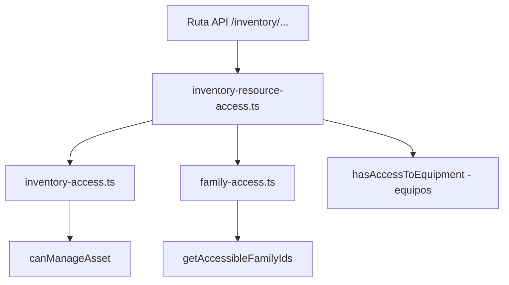
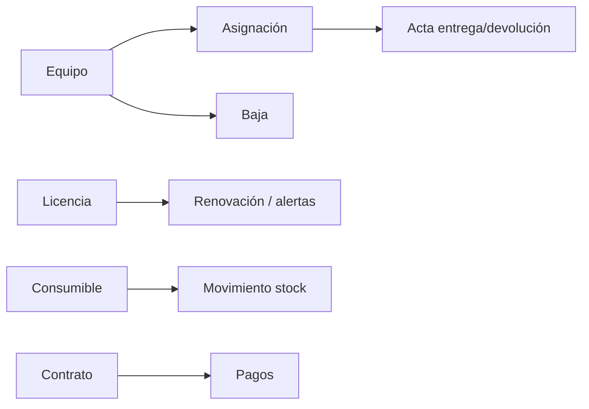

# Manual del Módulo de Inventario

**Sistema de Tickets — Documentación técnica**  
Versión · Mayo 2026 (en curso)

---

## Índice

1. [Alcance del módulo](#1-alcance-del-módulo)
2. [Roles y permisos](#2-roles-y-permisos)
3. [Capas de seguridad](#3-capas-de-seguridad)
4. [Entidades principales](#4-entidades-principales)
5. [Flujos críticos](#5-flujos-críticos)
6. [Roadmap de endurecimiento](#6-roadmap-de-endurecimiento)

---

## 1. Alcance del módulo

Gestión de activos por **familia (área)**:

- Equipos (modelos, lotes, QR, asignaciones, actas)
- Licencias de software
- Consumibles (MRO) y movimientos de stock
- Contratos y pagos
- Bodegas, proveedores, reportes

UI principal: `/inventory/*` y APIs bajo `/api/inventory/*`.

---

## 2. Roles y permisos

| Rol                               | Lectura                                                | Gestión                                   |
| --------------------------------- | ------------------------------------------------------ | ----------------------------------------- |
| **Super Admin**                   | Todo                                                   | Todo                                      |
| **Admin normal**                  | Familias en scope de inventario                        | Familias en scope                         |
| **Gestor** (`canManageInventory`) | Familias en `inventory_manager_families`               | Mismas familias                           |
| **Técnico**                       | Equipos/licencias/consumibles de sus familias técnicas | Según flags y flujo (asignaciones, actas) |
| **Cliente**                       | Equipos asignados a él                                 | No gestiona inventario global             |

---

## 3. Capas de seguridad



| Archivo                                          | Uso                                                                                                                |
| ------------------------------------------------ | ------------------------------------------------------------------------------------------------------------------ |
| `src/lib/inventory/inventory-resource-access.ts` | Assert por recurso ID (equipo, licencia, consumible, contrato, asignación, modelo, lote, bodega, proveedor, venta) |
| `src/lib/inventory/inventory-session.ts`         | `canManageInventory` y scope siempre desde BD (no JWT)                                                             |
| `src/lib/inventory-access.ts`                    | `canManageInventory`, `canManageAsset`                                                                             |
| `src/lib/inventory/family-access.ts`             | Listas y scope por familia                                                                                         |
| `src/lib/inventory/scope-filter.ts`              | Filtros en listados                                                                                                |
| `src/lib/middleware/family-filter.ts`            | Acceso a equipo por ID                                                                                             |

### Patrón recomendado en rutas `[id]`

```typescript
await assertInventoryResourceRead(user, 'CONSUMABLE', id) // GET
await assertInventoryResourceManage(user, 'LICENSE', id) // PUT/DELETE
await assertContractAccess(user, contractId, 'write') // pagos de contrato
```

Referencias de oro:

- `src/app/api/inventory/equipment/[id]/route.ts`
- `src/app/api/contracts/[id]/route.ts`

---

## 4. Entidades principales

| Entidad    | Familia vía                          |
| ---------- | ------------------------------------ |
| Equipo     | `equipment.type.familyId`            |
| Licencia   | `licenseType.familyId`               |
| Consumible | `consumableType.familyId`            |
| Contrato   | `contracts.familyId`                 |
| Asignación | `assignment.equipment.type.familyId` |

---

## 5. Flujos críticos



---

## 6. Roadmap de endurecimiento

### Hecho (P0 — mayo 2026)

- `POST /api/inventory/equipment` — valida familia del modelo
- `assignments/[id]` — GET/PATCH con scope de equipo/familia
- `consumables/[id]` y `movements` — lectura y escritura por familia
- `licenses/[id]` — GET/PUT/PATCH/DELETE con `canManageAsset`
- Rutas de pagos de contrato bajo `/api/inventory/contracts/...`

### Hecho (P1 — mayo 2026)

- `models/[id]`, `batches/[id]`, `warehouses/[id]`, `suppliers/[id]`, `families/[familyId]`
- `sales` y `sales/[id]` — scope por familia del equipo; gestores con `canManageInventory` en BD
- `inventory-session.ts` — listados y dashboard dejan de usar `session.user.canManageInventory` del JWT
- `equipment/[id]/custom-values` — assert por equipo

### Hecho (P2 — mayo 2026)

- `inventory-catalog-access.ts` — lectura catálogo, scope en listados, escritura global vs por familia
- `supplier-types`, `consumable-types`, `license-types`, `equipment-types` (GET), `units-of-measure` (GET)

### Pendiente

- Manual de usuario detallado por submódulo
- POST/PUT en `equipment-types` si se expone creación desde API

Ver [`LIMITACIONES_CONOCIDAS.md`](./LIMITACIONES_CONOCIDAS.md).

---

_Relacionado: [`FEATURES.md`](./FEATURES.md) · [`MANUAL_TICKETS.md`](./MANUAL_TICKETS.md)_
