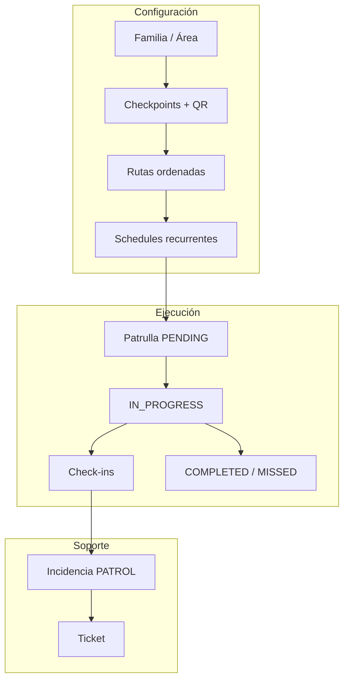
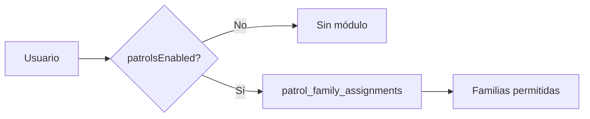
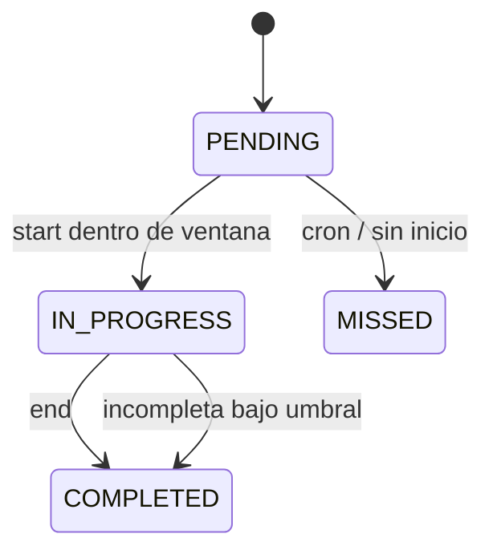
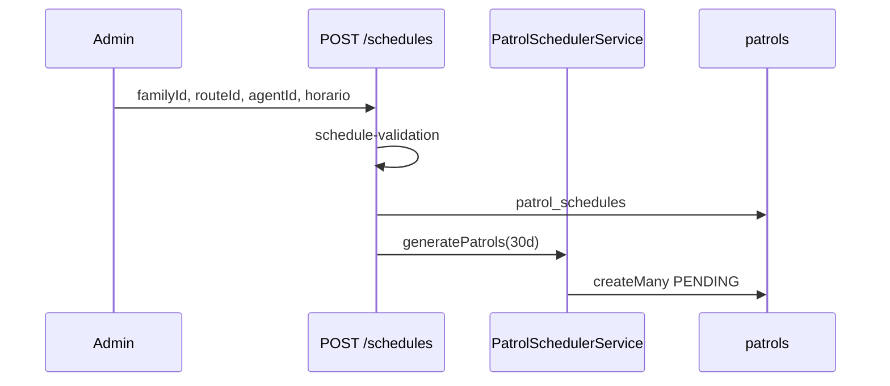
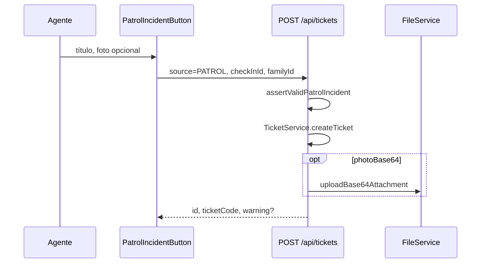

# Manual del Módulo de Rondas y Patrullajes

**Sistema de Tickets — Documentación técnica**  
Versión · Mayo 2026

---

## Índice

1. [¿Qué es el módulo de rondas?](#1-qué-es-el-módulo-de-rondas)
2. [Roles y acceso](#2-roles-y-acceso)
3. [Conceptos y entidades](#3-conceptos-y-entidades)
4. [Ciclo de vida de una ronda](#4-ciclo-de-vida-de-una-ronda)
5. [Programación y recurrencia](#5-programación-y-recurrencia)
6. [Ejecución en campo (agente)](#6-ejecución-en-campo-agente)
7. [Check-in, QR y geocerca](#7-check-in-qr-y-geocerca)
8. [Modo offline](#8-modo-offline)
9. [Incidencias → tickets](#9-incidencias--tickets)
10. [Cron y notificaciones](#10-cron-y-notificaciones)
11. [Reportes y cumplimiento](#11-reportes-y-cumplimiento)
12. [Configuración por familia](#12-configuración-por-familia)
13. [Referencia de API](#13-referencia-de-api)
14. [Archivos clave del código](#14-archivos-clave-del-código)

---

## 1. ¿Qué es el módulo de rondas?

Permite planificar recorridos por checkpoints, asignarlos a agentes (técnicos o clientes con `patrolsEnabled`), ejecutarlos en móvil con QR/GPS/fotos, y convertir hallazgos en tickets de soporte.

---

## 2. Roles y acceso

| Rol              | Capacidad en rondas                                                                   |
| ---------------- | ------------------------------------------------------------------------------------- |
| **Super Admin**  | Todo: configurar, programar, desactivar schedules, ver todas las familias             |
| **Admin normal** | Familias asignadas en módulo patrullas (`patrol_family_assignments` / scope admin)    |
| **Técnico**      | Ejecutar rondas asignadas si `patrolsEnabled`; supervisar incidencias de sus familias |
| **Cliente**      | Ejecutar rondas si `patrolsEnabled` y asignación en `patrol_family_assignments`       |

El helper `src/lib/patrol/patrol-access.ts` define qué familias puede ver o editar cada usuario.

---

## 3. Conceptos y entidades

| Entidad        | Descripción                                                      |
| -------------- | ---------------------------------------------------------------- |
| **Checkpoint** | Punto físico con QR (dinámico o estático), GPS opcional          |
| **Ruta**       | Secuencia ordenada de checkpoints por familia                    |
| **Schedule**   | Plantilla: agente, ruta, horario, recurrencia                    |
| **Patrulla**   | Instancia ejecutable (PENDING → IN_PROGRESS → COMPLETED/MISSED)  |
| **Check-in**   | Registro de visita a un checkpoint (VALID/INVALID, offline sync) |
| **Incidencia** | Ticket con `source=PATROL` ligado a un `checkInId`               |

---

## 4. Ciclo de vida de una ronda

### Estados

| Estado        | Significado                        |
| ------------- | ---------------------------------- |
| `PENDING`     | Generada, aún no iniciada          |
| `IN_PROGRESS` | Agente en recorrido                |
| `COMPLETED`   | Finalizada (con % de cumplimiento) |
| `MISSED`      | No iniciada a tiempo (cron)        |

### Ventana para iniciar

El agente solo puede iniciar entre:

- **Desde:** `scheduledStart − gracePeriodMinutes` (default 5 min)
- **Hasta:** `scheduledStart + gracePeriodMinutes` (no hasta `scheduledEnd`)

Implementado en `PATCH /api/patrols/[id]` con `action: start`.

---

## 5. Programación y recurrencia

### Crear schedule

`POST /api/patrols/schedules` valida:

1. Acceso del usuario a la **familia** (`checkPatrolFamilyAccess`)
2. **Ruta** activa y de la misma familia
3. **Agente** TECHNICIAN/CLIENT, `patrolsEnabled`, asignado en `patrol_family_assignments`
4. **Solapamiento** con otras patrullas del agente en **todas** las ocurrencias del horizonte (30 días), no solo la primera

`PatrolSchedulerService.generatePatrols` materializa instancias `PENDING`.

### Recurrencias

| Tipo                | Comportamiento                                |
| ------------------- | --------------------------------------------- |
| `NONE`              | Una sola patrulla en las fechas del schedule  |
| `DAILY`             | Una por día en el horizonte                   |
| `WEEKLY` / `CUSTOM` | Días en `recurrenceDays` (0=Dom … 6=Sáb, UTC) |

---

## 6. Ejecución en campo (agente)

Ruta UI: `/patrol/[id]`

1. Ver checkpoints y progreso
2. Iniciar ronda (foto si `requirePhotoOnStart`)
3. Escanear QR / check-in por checkpoint
4. Reportar incidencia (opcional, con foto)
5. Finalizar ronda (foto si `requirePhotoOnEnd`)

Solo el **agente asignado** puede iniciar, hacer check-in o finalizar.

---

## 7. Check-in, QR y geocerca

- **QR dinámico:** token rotatorio con ventana `qrWindowMinutes`
- **QR estático:** token fijo del checkpoint
- **GPS:** distancia vs `geofenceRadiusMeters` (familia o checkpoint)
- **Foto:** obligatoria si la familia lo exige en check-in válido

API: `POST /api/patrols/[id]/check-in` y `POST .../check-in/sync` para cola offline.

---

## 8. Modo offline

Hook `usePatrolOfflineQueue` guarda check-ins en `localStorage` y sincroniza con `/check-in/sync` al recuperar red.

Tolerancia: `offlineSyncToleranceMinutes` en `patrol_family_config`.

---

## 9. Incidencias → tickets

### Flujo

### Reglas de seguridad

- `checkInId` debe existir y pertenecer al **mismo agente** de la sesión
- La patrulla debe estar `IN_PROGRESS`
- `familyId` debe coincidir con la de la patrulla (no falsificable)
- Categoría: `patrolIncidentCategoryId` de la familia o categoría raíz por defecto

### Foto de evidencia

- **Opcional** en UI
- Si falla el adjunto, el ticket **sí se crea**; la respuesta incluye `warning` para reintentar desde el detalle del ticket

---

## 10. Cron y notificaciones

Job: `GET /api/cron/patrol` (protegido por secreto de cron)

| Tarea             | Descripción                                                                    |
| ----------------- | ------------------------------------------------------------------------------ |
| Generar patrullas | Schedules activos recurrentes                                                  |
| Recordatorios     | Patrullas PENDING que inician pronto; deduplicación por `metadata.reminderFor` |
| MISSED            | Marca patrullas no iniciadas tras grace period; notifica supervisores          |

---

## 11. Reportes y cumplimiento

- Dashboard: `GET /api/patrols/dashboard`
- Cumplimiento por agente/ruta: `GET /api/patrols/reports/compliance`
- Incidencias: `GET /api/patrols/incidents` (tickets `source=PATROL` filtrados por familia)

Exportaciones CSV desde páginas admin (historial, rutas, schedules, checkpoints).

---

## 12. Configuración por familia

`patrol_family_config` (una fila por familia):

| Campo                                       | Uso                                                    |
| ------------------------------------------- | ------------------------------------------------------ |
| `patrolsEnabled`                            | Habilita módulo en la familia                          |
| `gracePeriodMinutes`                        | Ventana antes/después de `scheduledStart` para iniciar |
| `qrWindowMinutes`                           | Validez del QR dinámico                                |
| `geofenceRadiusMeters`                      | Radio GPS por defecto                                  |
| `requirePhotoOnStart` / `requirePhotoOnEnd` | Fotos obligatorias                                     |
| `alertCompletionThreshold`                  | % mínimo antes de alertar incompleta                   |
| `patrolIncidentCategoryId`                  | Categoría por defecto de incidencias                   |
| `offlineSyncToleranceMinutes`               | Antigüedad máxima de cola offline                      |

UI admin: **Patrullas → Configuración por familia**.

---

## 13. Referencia de API

| Método       | Ruta                              | Descripción                 |
| ------------ | --------------------------------- | --------------------------- |
| GET/POST     | `/api/patrols/schedules`          | Listar / crear programación |
| PATCH/DELETE | `/api/patrols/schedules/[id]`     | Editar / desactivar         |
| GET/PATCH    | `/api/patrols/[id]`               | Detalle / start·end         |
| POST         | `/api/patrols/[id]/check-in`      | Check-in en línea           |
| POST         | `/api/patrols/[id]/check-in/sync` | Sincronizar offline         |
| GET          | `/api/patrols/incidents`          | Listado incidencias         |
| GET          | `/api/patrols/dashboard`          | Métricas del día            |
| GET/POST     | `/api/patrols/routes`             | Rutas                       |
| GET/POST     | `/api/patrols/checkpoints`        | Checkpoints                 |

---

## 14. Archivos clave del código

| Archivo                                            | Rol                             |
| -------------------------------------------------- | ------------------------------- |
| `src/lib/patrol/patrol-access.ts`                  | Scope de familias               |
| `src/lib/patrol/schedule-validation.ts`            | Validación de schedules         |
| `src/lib/patrol/patrol-helpers.ts`                 | Módulo habilitado, supervisores |
| `src/lib/services/patrol-scheduler.service.ts`     | Generación, cron, recordatorios |
| `src/lib/tickets/patrol-incident-validation.ts`    | Incidencias PATROL              |
| `src/components/patrol/patrol-incident-button.tsx` | UI de incidencia                |

---

_Relacionado: [`MANUAL_TICKETS.md`](./MANUAL_TICKETS.md) · [`LIMITACIONES_CONOCIDAS.md`](./LIMITACIONES_CONOCIDAS.md)_
