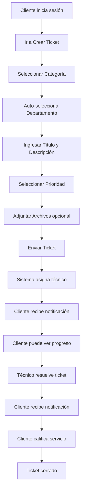
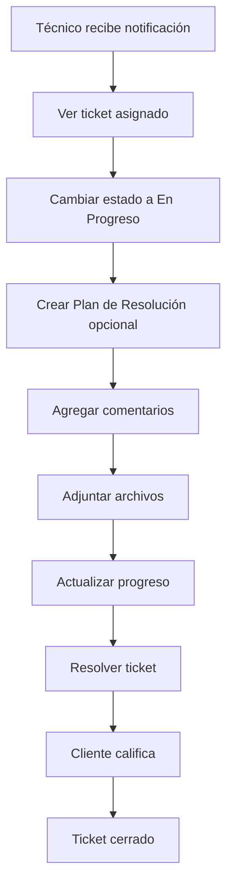

# 🎫 Módulo de Tickets

**Prioridad:** CRÍTICA  
**Complejidad:** MUY ALTA  
**Estado:** ✅ Completado y Funcionando

---

## 📋 DESCRIPCIÓN GENERAL

El módulo de tickets es el núcleo del sistema. Gestiona todo el ciclo de vida de las solicitudes de soporte, desde la creación hasta el cierre, incluyendo asignación automática, seguimiento, comentarios, archivos adjuntos y calificaciones.

---

## 🎯 FUNCIONALIDADES PRINCIPALES

### 1. Creación de Tickets
- ✅ Formulario intuitivo para clientes
- ✅ Selección de categoría con cascada automática
- ✅ Auto-selección de departamento según categoría
- ✅ Selección de prioridad
- ✅ Adjuntar múltiples archivos
- ✅ Validación de campos
- ✅ Creación por admin en nombre del cliente

### 2. Asignación Automática
- ✅ Algoritmo inteligente de asignación
- ✅ Basado en categoría del ticket
- ✅ Considera carga de trabajo del técnico
- ✅ Respeta prioridades de asignación
- ✅ Verifica límites de tickets por técnico
- ✅ Notifica al técnico asignado

### 3. Estados del Ticket
```typescript
enum TicketStatus {
  OPEN          // Recién creado, sin asignar o asignado
  IN_PROGRESS   // Técnico trabajando en él
  RESOLVED      // Técnico lo marcó como resuelto
  CLOSED        // Cliente confirmó la resolución
}
```

### 4. Prioridades
```typescript
enum TicketPriority {
  LOW      // Baja prioridad
  MEDIUM   // Prioridad media (default)
  HIGH     // Alta prioridad
  URGENT   // Urgente, requiere atención inmediata
}
```

### 5. Fuentes de Tickets
```typescript
enum TicketSource {
  WEB     // Creado desde la interfaz web
  EMAIL   // Creado desde email
  PHONE   // Creado desde llamada telefónica
  CHAT    // Creado desde chat
  API     // Creado desde API externa
  ADMIN   // Creado por admin en nombre del cliente
}
```

---

## 🔄 FLUJO COMPLETO

### Flujo del Cliente



### Flujo del Técnico



---

## 📊 ESTRUCTURA DE DATOS

### Tabla Principal: `tickets`

```typescript
interface Ticket {
  id: string
  title: string
  description: string
  status: TicketStatus
  priority: TicketPriority
  clientId: string
  assigneeId: string | null
  categoryId: string
  createdById: string | null
  resolvedAt: DateTime | null
  closedAt: DateTime | null
  firstResponseAt: DateTime | null
  slaDeadline: DateTime | null
  estimatedTime: number | null  // minutos
  actualTime: number | null      // minutos
  tags: string[]
  source: TicketSource
  createdAt: DateTime
  updatedAt: DateTime
  
  // Relaciones
  client: User
  assignee: User | null
  category: Category
  createdBy: User | null
  comments: Comment[]
  attachments: Attachment[]
  history: TicketHistory[]
  notifications: Notification[]
  rating: TicketRating | null
  resolutionPlan: TicketResolutionPlan | null
}
```

---

## 🎨 COMPONENTES UI

### Componentes Principales

#### 1. `TicketForm` (Creación/Edición)
**Ubicación:** `src/components/tickets/ticket-form.tsx`

**Props:**
```typescript
interface TicketFormProps {
  mode: 'create' | 'edit'
  initialData?: Partial<Ticket>
  onSuccess?: () => void
}
```

**Funcionalidades:**
- Formulario con validación
- Selección de categoría con cascada
- Carga de archivos
- Previsualización de archivos
- Validación en tiempo real

#### 2. `TicketTable` (Lista de Tickets)
**Ubicación:** `src/components/tickets/ticket-table.tsx`

**Props:**
```typescript
interface TicketTableProps {
  tickets: Ticket[]
  role: UserRole
  onTicketClick?: (ticket: Ticket) => void
}
```

**Funcionalidades:**
- Tabla responsive
- Filtros por estado, prioridad, categoría
- Búsqueda por título/descripción
- Ordenamiento por columnas
- Paginación
- Acciones rápidas

#### 3. `TicketTimeline` (Timeline de Eventos)
**Ubicación:** `src/components/ui/ticket-timeline.tsx`

**Funcionalidades:**
- Muestra historial completo
- Cambios de estado
- Comentarios
- Archivos adjuntos
- Asignaciones
- Formato de fecha relativa

#### 4. `TicketRatingSystem` (Calificación)
**Ubicación:** `src/components/ui/ticket-rating-system.tsx`

**Funcionalidades:**
- Calificación general (1-5 estrellas)
- Calificaciones específicas:
  - Tiempo de respuesta
  - Habilidad técnica
  - Comunicación
  - Resolución del problema
- Comentarios opcionales
- Validación

---

## 🔌 API ENDPOINTS

### Endpoints Principales

#### 1. Crear Ticket
```typescript
POST /api/tickets
Body: {
  title: string
  description: string
  categoryId: string
  priority: TicketPriority
  attachments?: File[]
}
Response: {
  success: boolean
  ticket: Ticket
}
```

#### 2. Listar Tickets
```typescript
GET /api/tickets?status=OPEN&priority=HIGH&page=1&limit=10
Response: {
  tickets: Ticket[]
  total: number
  page: number
  totalPages: number
}
```

#### 3. Obtener Ticket por ID
```typescript
GET /api/tickets/[id]
Response: {
  ticket: Ticket
  comments: Comment[]
  attachments: Attachment[]
  history: TicketHistory[]
}
```

#### 4. Actualizar Ticket
```typescript
PATCH /api/tickets/[id]
Body: {
  status?: TicketStatus
  priority?: TicketPriority
  assigneeId?: string
}
Response: {
  success: boolean
  ticket: Ticket
}
```

#### 5. Agregar Comentario
```typescript
POST /api/tickets/[id]/comments
Body: {
  content: string
  isInternal: boolean
}
Response: {
  success: boolean
  comment: Comment
}
```

#### 6. Calificar Ticket
```typescript
POST /api/tickets/[id]/rating
Body: {
  rating: number
  responseTime: number
  technicalSkill: number
  communication: number
  problemResolution: number
  feedback?: string
}
Response: {
  success: boolean
  rating: TicketRating
}
```

---

## 🤖 ASIGNACIÓN AUTOMÁTICA

### Algoritmo de Asignación

```typescript
async function autoAssignTicket(ticket: Ticket): Promise<User | null> {
  // 1. Obtener técnicos de la categoría
  const assignments = await getTechniciansByCategory(ticket.categoryId)
  
  // 2. Filtrar técnicos activos con auto-asignación habilitada
  const availableTechnicians = assignments.filter(a => 
    a.isActive && a.autoAssign
  )
  
  // 3. Ordenar por prioridad
  availableTechnicians.sort((a, b) => b.priority - a.priority)
  
  // 4. Verificar carga de trabajo
  for (const assignment of availableTechnicians) {
    const currentTickets = await getActiveTick etsCount(assignment.technicianId)
    
    if (!assignment.maxTickets || currentTickets < assignment.maxTickets) {
      return assignment.technician
    }
  }
  
  // 5. Si todos están al límite, asignar al de menor carga
  return getTechnicianWithLeastLoad(availableTechnicians)
}
```

### Factores Considerados:
1. **Categoría del ticket:** Solo técnicos asignados a esa categoría
2. **Prioridad de asignación:** Técnicos con mayor prioridad primero
3. **Carga de trabajo:** Respeta límites de tickets por técnico
4. **Disponibilidad:** Solo técnicos activos y con auto-asignación
5. **Balance de carga:** Distribuye equitativamente

---

## 📈 MÉTRICAS Y ESTADÍSTICAS

### Métricas por Ticket
- **Tiempo de primera respuesta:** `firstResponseAt - createdAt`
- **Tiempo de resolución:** `resolvedAt - createdAt`
- **Tiempo total:** `closedAt - createdAt`
- **Cumplimiento de SLA:** `resolvedAt <= slaDeadline`

### Métricas Agregadas
- Total de tickets por estado
- Tickets por prioridad
- Tickets por categoría
- Tiempo promedio de resolución
- Tasa de satisfacción (ratings)
- Tickets por técnico
- Tickets por cliente

---

## 🔔 NOTIFICACIONES

### Eventos que Generan Notificaciones

1. **Ticket Creado**
   - Notifica al técnico asignado
   - Notifica a admins (opcional)

2. **Ticket Asignado/Reasignado**
   - Notifica al nuevo técnico
   - Notifica al cliente

3. **Estado Cambiado**
   - Notifica al cliente
   - Notifica a admins (opcional)

4. **Comentario Agregado**
   - Notifica al cliente (si es del técnico)
   - Notifica al técnico (si es del cliente)

5. **Ticket Resuelto**
   - Notifica al cliente
   - Solicita calificación

6. **Ticket Cerrado**
   - Notifica al técnico
   - Notifica a admins (opcional)

---

## 🔒 PERMISOS Y SEGURIDAD

### Permisos por Rol

#### ADMIN
- ✅ Ver todos los tickets
- ✅ Crear tickets en nombre de clientes
- ✅ Editar cualquier ticket
- ✅ Eliminar tickets
- ✅ Reasignar tickets
- ✅ Ver comentarios internos
- ✅ Acceder a estadísticas completas

#### TECHNICIAN
- ✅ Ver tickets asignados
- ✅ Actualizar estado de tickets asignados
- ✅ Agregar comentarios (públicos e internos)
- ✅ Adjuntar archivos
- ✅ Crear planes de resolución
- ✅ Ver estadísticas propias
- ❌ Ver tickets de otros técnicos
- ❌ Eliminar tickets

#### CLIENT
- ✅ Crear tickets
- ✅ Ver tickets propios
- ✅ Agregar comentarios públicos
- ✅ Adjuntar archivos
- ✅ Calificar tickets resueltos
- ❌ Ver tickets de otros clientes
- ❌ Cambiar estado de tickets
- ❌ Ver comentarios internos

---

## 🧪 TESTING

### Tests Implementados

#### Tests Unitarios
- ✅ Validación de formularios
- ✅ Lógica de asignación automática
- ✅ Cálculo de métricas
- ✅ Formateo de datos

#### Tests de Integración
- ✅ Flujo completo de creación
- ✅ Flujo de asignación
- ✅ Flujo de resolución
- ✅ Sistema de comentarios
- ✅ Sistema de calificación

#### Tests E2E
- ✅ Cliente crea ticket
- ✅ Técnico resuelve ticket
- ✅ Cliente califica ticket
- ✅ Admin gestiona tickets

---

## 🐛 PROBLEMAS CONOCIDOS Y SOLUCIONES

### ✅ Resueltos

1. **Error de cascada en categorías**
   - **Problema:** No se auto-seleccionaba el departamento
   - **Solución:** Implementado useEffect para cascada automática

2. **Duplicación de notificaciones**
   - **Problema:** Se enviaban notificaciones duplicadas
   - **Solución:** Implementado sistema de deduplicación

3. **Error SSR en selectores**
   - **Problema:** Componentes no renderizaban en servidor
   - **Solución:** Implementado dynamic import con ssr: false

4. **Sincronización de estado**
   - **Problema:** Estado no se actualizaba en tiempo real
   - **Solución:** Implementado Redis para pub/sub

---

## 📚 ARCHIVOS RELACIONADOS

### Componentes
```
src/components/tickets/
├── ticket-form.tsx
├── ticket-table.tsx
├── file-upload.tsx
└── auto-assignment.tsx

src/components/ui/
├── ticket-timeline.tsx
├── ticket-rating-system.tsx
├── ticket-resolution-tracker.tsx
└── ticket-stats-card.tsx
```

### API Routes
```
src/app/api/tickets/
├── route.ts (GET, POST)
├── [id]/
│   ├── route.ts (GET, PATCH, DELETE)
│   ├── comments/route.ts
│   ├── attachments/route.ts
│   └── rating/route.ts
└── stats/route.ts
```

### Servicios
```
src/lib/services/
├── ticket-service.ts
├── ticket-notification-service.ts
└── assignment-service.ts
```

### Páginas
```
src/app/
├── admin/tickets/
├── client/
│   ├── tickets/
│   └── create-ticket/
└── technician/tickets/
```

---

## 🚀 MEJORAS FUTURAS

### Corto Plazo
- [ ] Implementar SLA automático
- [ ] Agregar plantillas de tickets
- [ ] Mejorar búsqueda con Elasticsearch
- [ ] Agregar filtros guardados

### Mediano Plazo
- [ ] Integración con email (crear tickets desde email)
- [ ] Chat en vivo integrado
- [ ] Automatización de respuestas
- [ ] IA para categorización automática

### Largo Plazo
- [ ] App móvil nativa
- [ ] Integración con Teams/Slack
- [ ] Sistema de knowledge base
- [ ] Análisis predictivo con ML

---

**Última actualización:** 16/01/2026  
**Próxima revisión:** Durante auditoría completa
